# 深度解析 go-nanobot：从 Python 到 Go 的 AI Agent 框架复刻之路

> 本文从架构设计、核心原理、完整流程到代码实现，全方位剖析 go-nanobot 项目。同时与 Python 版 nanobot 进行逐模块对比，并追溯其上游项目 OpenClaw（小龙虾/Clawdbot）的演化脉络，呈现一个"430K 行 → 4K 行 → 7.4K 行"的 AI Agent 极简化实践。

---

## 一、项目背景：三代 AI Agent 的演化

### 1.1 OpenClaw（Clawdbot / 小龙虾）—— 全功能 AI 助手

OpenClaw（又名 Clawdbot，中文社区称"小龙虾"）是一个全功能个人 AI 助手平台，代码量超过 **430,000 行**。它具备：

- 完整的多轮对话系统
- 数十种内置工具（文件、Shell、浏览器自动化、代码执行等）
- 多 LLM Provider 支持
- 多渠道集成（Telegram、Discord、Slack、飞书、钉钉、邮件等）
- 技能市场（ClawHub）
- 定时任务、心跳服务、子 Agent 系统
- 完善的记忆和会话管理

OpenClaw 功能极其丰富，但代码体量巨大，部署和二次开发门槛高。

### 1.2 nanobot（Python）—— 99% 瘦身的精简版

nanobot 是 OpenClaw 的**极简精简版**，核心理念是：

> *用 ~4,000 行 Python 代码实现 OpenClaw 99% 的核心能力。*

nanobot 保留了 OpenClaw 的核心架构（Agent Loop、Tool Calling、多渠道、多 Provider、记忆系统、技能系统），但做了大量简化：

| 维度 | OpenClaw | nanobot |
|------|----------|---------|
| 代码量 | 430,000+ 行 | ~4,000 行核心代码 |
| 语言 | Python (多个子系统) | 纯 Python |
| LLM 调用 | 自研 Provider 层 | LiteLLM 统一封装 |
| 浏览器自动化 | 完整支持 | 移除 |
| 代码沙箱 | Docker 隔离 | 直接 Shell 执行 + 安全正则 |
| 部署方式 | Docker Compose | `pip install nanobot-ai` |
| 技能系统 | 完整商店 + 运行时 | Markdown 指令 + Shell 脚本 |
| 配置系统 | 多文件分层 | 单文件 YAML |

nanobot 证明了一个核心观点：**AI Agent 的核心并不复杂**。真正的工作由 LLM 完成，框架只需做好"消息路由 + 工具编排 + 状态管理"三件事。

### 1.3 go-nanobot（Go）—— 跨语言复刻版

go-nanobot 是 nanobot 的 **Go 语言 1:1 复刻版本**，目标是：

- 功能对齐 Python 版 nanobot
- 利用 Go 的编译型语言优势：单二进制部署、更低内存、更好的并发
- 基于 [Eino ADK](https://github.com/cloudwego/eino)（字节跳动 Cloudwego 开源）替代 LiteLLM
- 保持代码简洁，总量 **~7,400 行 Go 代码**

三者关系：

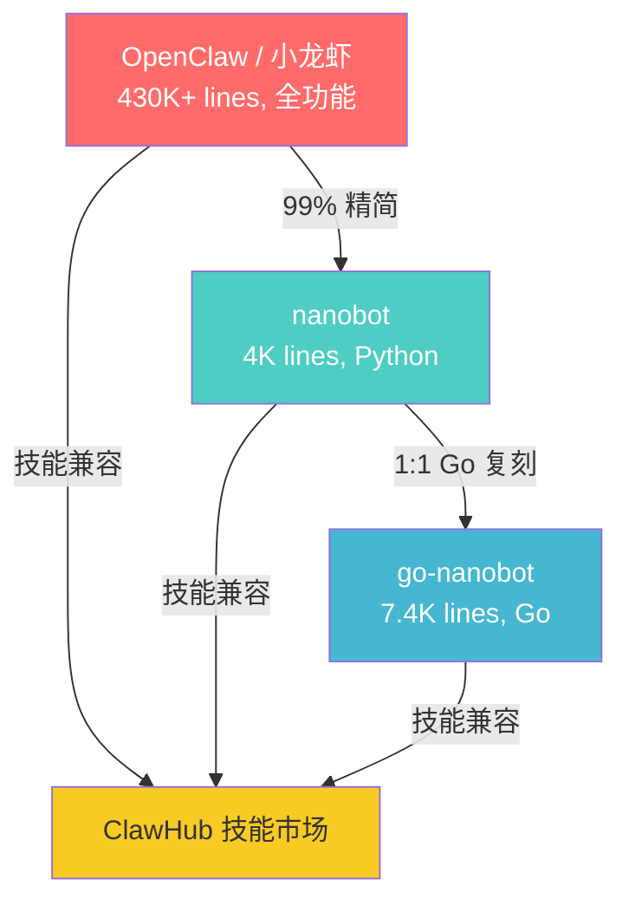

> Go 版代码量（7.4K）比 Python 版（4K 核心 / 10K 含渠道）多约 85%，原因是 Go 语言本身更冗长（显式错误处理、无列表推导、结构体声明等），但逻辑完全对齐。

---

## 二、整体架构设计

### 2.1 分层架构

go-nanobot 采用经典的**分层 + 事件驱动**架构：

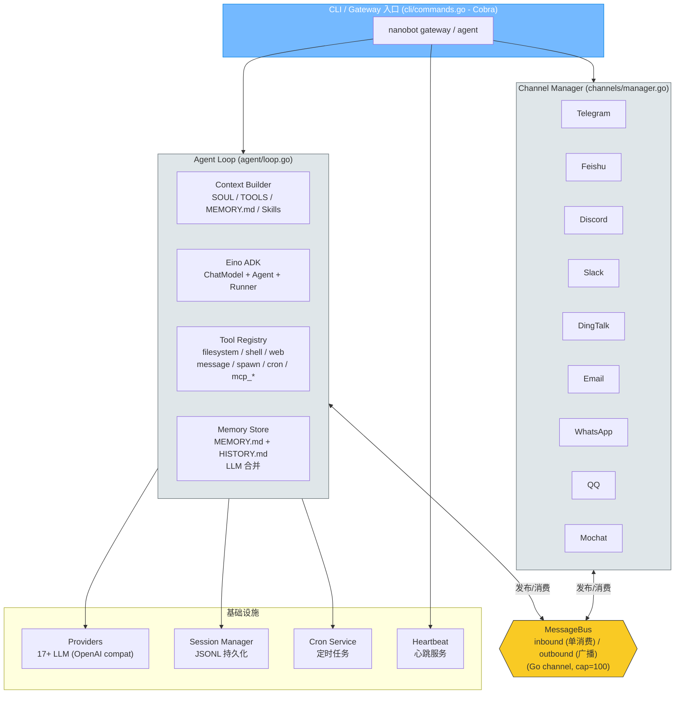

### 2.2 包依赖图

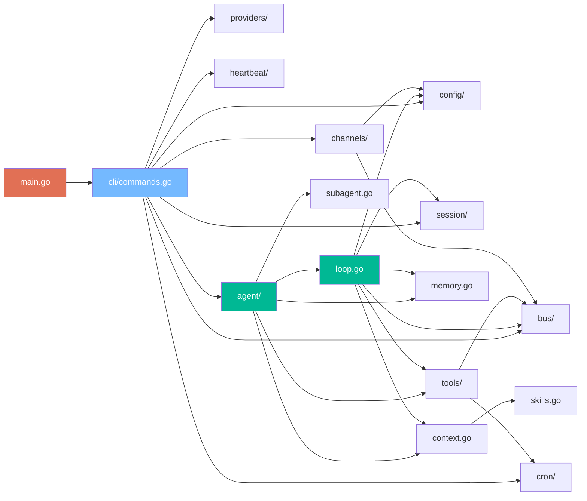

### 2.3 设计模式

| 模式 | 应用场景 | 实现 |
|------|---------|------|
| **发布-订阅** | 渠道 ↔ Agent 通信 | `MessageBus` 广播模式 (fanOut + SubscribeOutbound) |
| **适配器** | nanobot Tool → Eino BaseTool | `einoToolAdapter` |
| **工厂** | 渠道创建 | `RegisterFactory()` + `GetFactory()` |
| **注册表** | 工具、Provider、渠道 | `Registry.Register()` |
| **策略** | Provider 匹配 | 前缀 → 关键字 → 回退 三级策略 |
| **模板方法** | 渠道基类 | `BaseChannel.HandleMessage()` |
| **依赖注入** | 组件初始化 | 配置结构体传递 |

---

## 三、核心流程详解

### 3.1 启动流程（Gateway 模式）

Gateway 是 go-nanobot 的主运行模式，启动 Agent + 所有渠道 + 心跳服务：

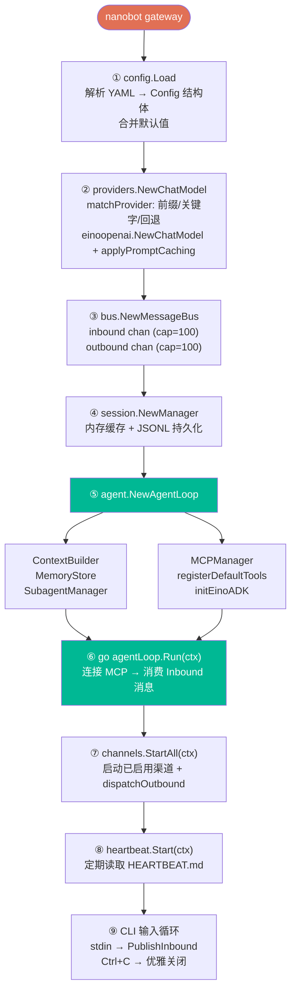

### 3.2 消息处理流程（核心 Agent Loop）

当一条用户消息到达时：

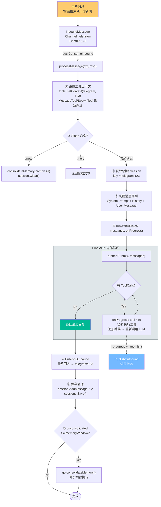

### 3.3 飞书渠道完整流程

以飞书（Feishu/Lark）为例，展示渠道从配置到消息收发的完整链路：

```yaml
# nanobot.yaml 配置
channels:
  feishu:
    enabled: true
    app_id: "cli_xxxxx"
    app_secret: "secret_xxxxx"
    encrypt_key: "encrypt_xxxxx"
    verification_token: "verify_xxxxx"
```

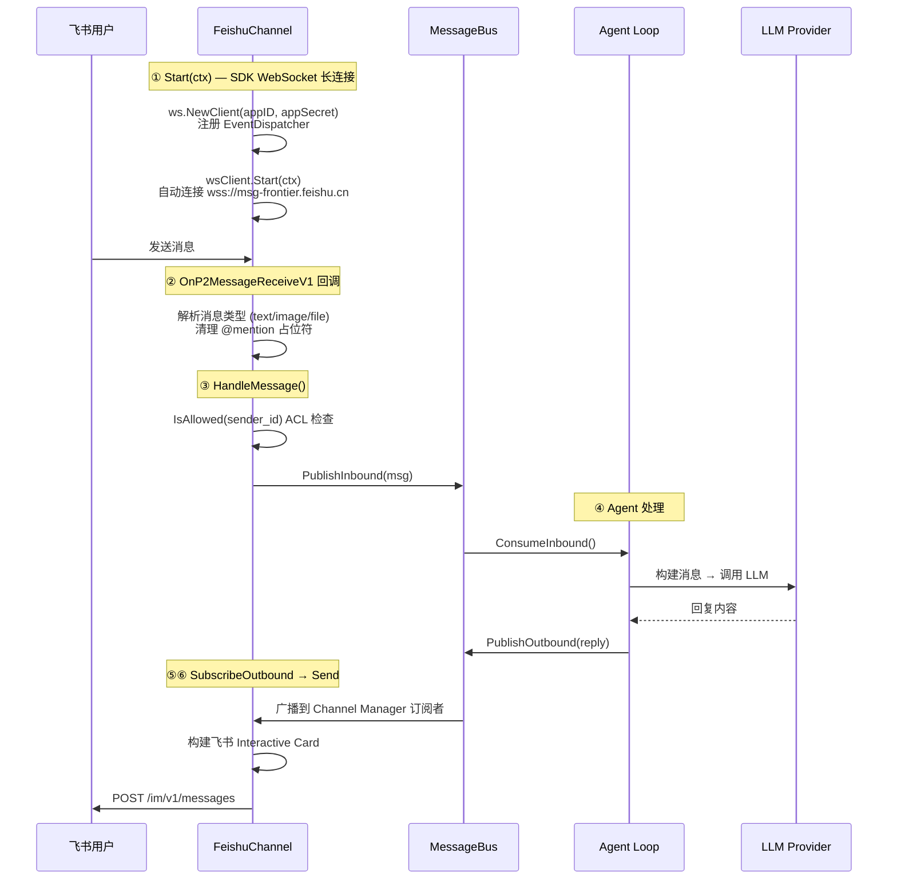

### 3.4 CLI 直连模式流程

**单消息模式** (`nanobot agent -m "你好"`)：

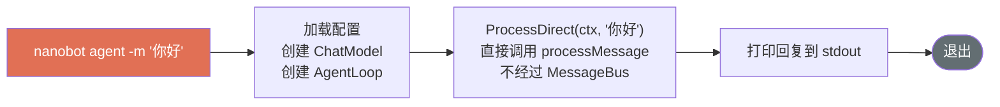

**交互模式** (`nanobot agent`)：

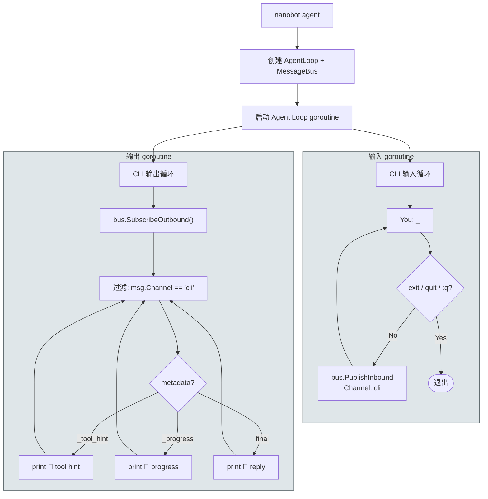

### 3.5 记忆合并流程

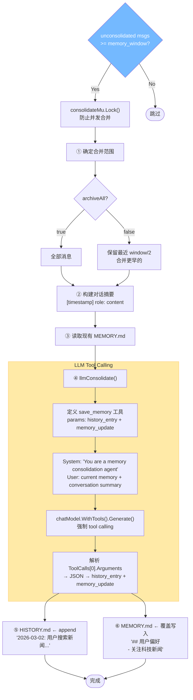

### 3.6 MCP 工具加载流程

```yaml
# nanobot.yaml
tools:
  mcp_servers:
    filesystem:
      command: "npx"
      args: ["-y", "@modelcontextprotocol/server-filesystem", "/tmp"]
    remote-api:
      url: "https://mcp.example.com/sse"
      headers:
        Authorization: "Bearer token"
```

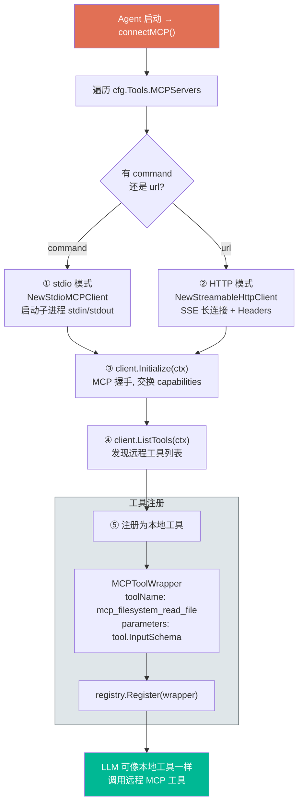

### 3.7 定时任务（Cron）流程

**关键设计要点：**

- **时区处理**：所有时间默认使用 `Asia/Shanghai`（东八区/北京时间）。`parseISOTime()` 对无时区后缀的时间串使用 `time.ParseInLocation`，避免 Go 的 `time.Parse` 默认 UTC 导致的时差问题。
- **实时唤醒**：`AddJob()` 调用后通过 `wake chan` 立即唤醒 `timerLoop`，无需等待 30 秒轮询周期。
- **真正的 Cron 解析**：使用 `robfig/cron/v3` 解析标准 5 字段 Cron 表达式，替代之前的 30 分钟占位实现。
- **渠道路由**：Cron 触发后使用 Job 保存的原始 `channel` 和 `chatID` 发布入站消息（而非 `channel="cron"`），确保 Agent 回复能正确路由回原始渠道。

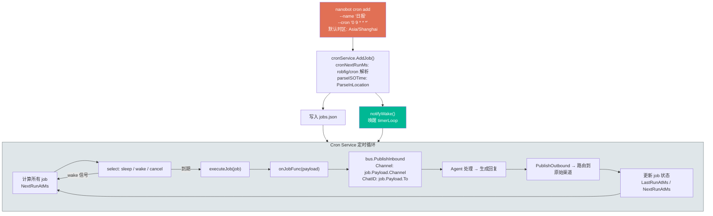

---

## 四、核心模块深度剖析

### 4.1 Eino ADK 集成（vs Python LiteLLM）

这是 Go 版与 Python 版最大的架构差异。

**Python 版：LiteLLM 统一封装**

```python
# nanobot 使用 LiteLLM 作为统一 LLM 网关
from litellm import acompletion

response = await acompletion(
    model="anthropic/claude-opus-4-5",
    messages=messages,
    tools=tool_definitions,
    api_key=api_key,
)
```

LiteLLM 是一个 Python 库，封装了 100+ LLM Provider 的 API 差异，提供统一的 OpenAI 格式接口。nanobot 的 Agent Loop 直接调用 `acompletion()`，自行实现 tool call 循环。

**Go 版：Eino ADK 框架**

```go
// go-nanobot 使用字节跳动的 Eino ADK
import (
    adk "github.com/cloudwego/eino/flow/agent"
    einoopenai "github.com/cloudwego/eino-ext/components/model/openai"
)

// 创建 ChatModel（OpenAI 兼容接口）
chatModel, _ := einoopenai.NewChatModel(ctx, &einoopenai.ChatModelConfig{
    Model:   "anthropic/claude-opus-4-5",
    APIKey:  apiKey,
    BaseURL: baseURL,
})

// 创建 Agent（封装 tool call 循环）
agent, _ := adk.NewChatModelAgent(ctx, &adk.ChatModelAgentConfig{
    Model:       chatModel,
    ToolsConfig: toolsConfig,
})

// 创建 Runner（流式事件迭代器）
runner := adk.NewRunner(ctx, adk.RunnerConfig{Agent: agent})
iter := runner.Run(ctx, messages)
```

Eino ADK 封装了完整的 Agent 执行循环（LLM 调用 → 解析 tool calls → 执行工具 → 追加结果 → 重新调用 LLM），go-nanobot 只需消费事件流。

**关键差异对比：**

| 维度 | Python (LiteLLM) | Go (Eino ADK) |
|------|------------------|----------------|
| 职责 | 仅统一 API 格式 | 完整 Agent 编排 |
| Tool 循环 | nanobot 自行实现 | ADK 内置 |
| 流式支持 | 手动处理 SSE | 事件迭代器 |
| Provider 数量 | 100+ (LiteLLM 内置) | 17 (手动注册) |
| 模型前缀 | LiteLLM 自动路由 | 原样传递 |

### 4.2 工具系统设计

**接口定义对比：**

```python
# Python: 抽象基类
class Tool(ABC):
    @property
    @abstractmethod
    def name(self) -> str: ...

    @abstractmethod
    async def execute(self, **kwargs) -> str: ...
```

```go
// Go: 接口
type Tool interface {
    Name() string
    Description() string
    Parameters() map[string]any
    Execute(ctx context.Context, params map[string]any) (string, error)
}
```

**工具注册与 Eino 适配：**

go-nanobot 需要一个适配器将自己的 `Tool` 接口转换为 Eino 的 `BaseTool`：

```go
type einoToolAdapter struct {
    tool Tool
}

func (a *einoToolAdapter) InvokableRun(ctx context.Context, argumentsInJSON string, opts ...tool.Option) (string, error) {
    var params map[string]any
    json.Unmarshal([]byte(argumentsInJSON), &params)
    return a.tool.Execute(ctx, params)
}
```

这一层在 Python 版中不需要——因为 nanobot Python 版直接管理 tool call 循环，不依赖外部框架的工具接口。

**Shell 安全检查（两版完全对齐）：**

```python
# Python 版
deny_patterns = [
    r"\brm\s+-[rf]{1,2}\b",
    r"\bdd\s+if=",
    r":\(\)\s*\{.*\};\s*:",  # fork bomb
    # ... 共 9 个
]
```

```go
// Go 版
var denyPatterns = []*regexp.Regexp{
    regexp.MustCompile(`(?i)\brm\s+-[rf]{1,2}\b`),
    regexp.MustCompile(`(?i)\bdd\s+if=`),
    regexp.MustCompile(`:\(\)\s*\{.*\};\s*:`),
    // ... 共 9 个（完全对齐）
}
```

Go 版额外实现了路径遍历检测和绝对路径校验（`RestrictToWorkspace` 模式下），这是 Python 版也有但 Go 版做了增强的部分。

**edit_file 模糊匹配（Go 版增强）：**

当 `old_string` 在文件中找不到时：

```
Python 版: "old_string not found in file" (简单报错)
                 ↓ （后续版本增加了 diff 提示）
Go 版:     notFoundMessage() → 滑动窗口相似度计算 → unified diff 格式提示

示例输出:
  "old_string not found in /path/to/file.go
   Best match (72% similar) at lines 45-52:
   --- old_string
   +++ actual (lines 45-52)
   - func oldName() {
   + func newName() {
     return nil
   }"
```

### 4.3 记忆系统设计

**双层记忆架构（两版完全一致）：**

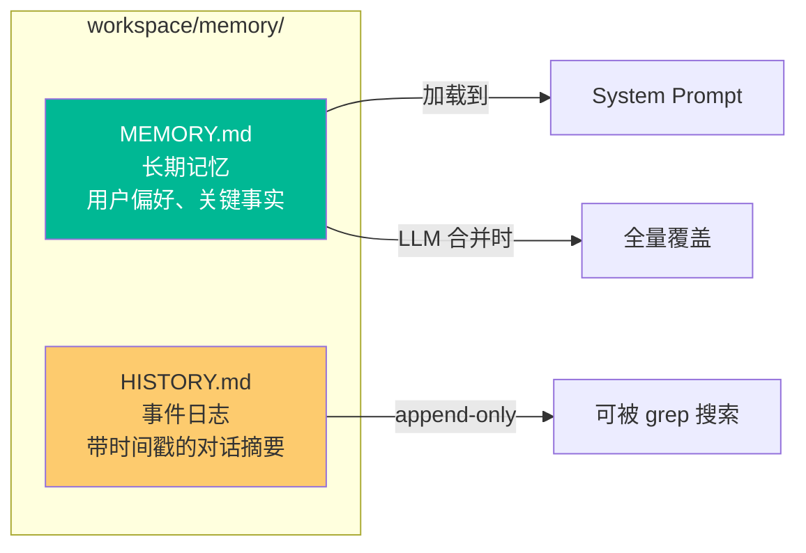

**合并方式对比：**

| 方面 | Python 版 | Go 版 |
|------|----------|-------|
| 触发条件 | `unconsolidated >= memory_window` | 相同 |
| 合并方法 | LLM tool calling (`save_memory`) | 相同 |
| 工具定义 | `_SAVE_MEMORY_TOOL` 常量 | `schema.ToolInfo` 构建 |
| 回退方案 | 无（LLM 失败则不合并） | `fallbackConsolidate()` 简单提取 |
| 并发保护 | `asyncio.Lock` per session | `sync.Mutex` |
| `/new` 行为 | `archive_all=True` 先合并 | 相同 |

### 4.4 渠道系统设计

**渠道基类对比：**

```python
# Python: ABC + dataclass
class BaseChannel(ABC):
    bus: MessageBus
    allow_from: list[str]

    def is_allowed(self, sender_id: str) -> bool:
        return not self.allow_from or sender_id in self.allow_from

    async def _handle_message(self, channel, sender_id, chat_id, content, media=None):
        if not self.is_allowed(sender_id): return
        await self.bus.publish_inbound(InboundMessage(...))
```

```go
// Go: 结构体嵌入
type BaseChannel struct {
    ChannelName string
    Bus         *bus.MessageBus
    AllowFrom   []string
    Logger      *zap.Logger
}

func (b *BaseChannel) IsAllowed(senderID string) bool {
    if len(b.AllowFrom) == 0 { return true }
    for _, id := range b.AllowFrom { if id == senderID { return true } }
    return false
}
```

**渠道实现完整度对比：**

| 渠道 | Python 版 | Go 版 | 备注 |
|------|----------|-------|------|
| Telegram | 完整 (长轮询 + 语音转写) | 基础 (长轮询) | Go 版缺语音转写 |
| Discord | 完整 (WebSocket Gateway) | 基础 (REST API) | Go 版未用 WebSocket |
| Slack | 完整 (Socket Mode) | 基础框架 | Go 版用 HTTP |
| 飞书 | 完整 (WebSocket) | 完整 (SDK WebSocket + 知识库/文档工具) | 功能对齐 |
| 钉钉 | 完整 (Stream Mode) | 基础框架 | |
| 邮件 | 完整 (IMAP/SMTP) | 基础框架 | |
| WhatsApp | 完整 (Node.js Bridge) | 基础框架 | |
| QQ | 完整 (botpy SDK) | 基础框架 | |
| Mochat | 完整 (Socket.IO) | 基础框架 | |

> Go 版大部分渠道实现了核心框架（接口、配置、连接逻辑），但细节功能（如 Telegram 语音转写、Discord WebSocket Gateway）尚需完善。

### 4.5 消息总线设计

**Python 版：asyncio.Queue**

```python
class MessageBus:
    def __init__(self):
        self.inbound = asyncio.Queue()
        self.outbound = asyncio.Queue()

    async def publish_inbound(self, msg): await self.inbound.put(msg)
    async def consume_inbound(self): return await self.inbound.get()
```

**Go 版：buffered channel + 广播模式**

```go
type MessageBus struct {
    inbound     chan *InboundMessage   // 容量 100, 单消费者 (Agent Loop)
    outbound    chan *OutboundMessage  // 容量 100, 广播源
    subscribers map[int]chan *OutboundMessage  // 多订阅者
}

// Outbound 采用广播模式: CLI handler 和 Channel Manager 各自订阅
func (b *MessageBus) SubscribeOutbound() (<-chan *OutboundMessage, func()) {
    ch := make(chan *OutboundMessage, 100)
    // 注册订阅者, 返回 channel + 取消函数
    return ch, unsubscribe
}

// fanOut goroutine 将 outbound 消息广播给所有订阅者
func (b *MessageBus) fanOut() {
    for msg := range b.outbound {
        for _, ch := range b.subscribers {
            ch <- msg  // 非阻塞, 缓冲满则跳过
        }
    }
}
```

Go 版的 Outbound 从单消费者模型升级为**广播模式**：CLI handler 和 Channel Manager 各自通过 `SubscribeOutbound()` 获得独立的消费 channel，互不干扰。`fanOut` goroutine 负责将每条出站消息广播给所有订阅者。

### 4.6 Provider 匹配策略

三级匹配（两版一致）：

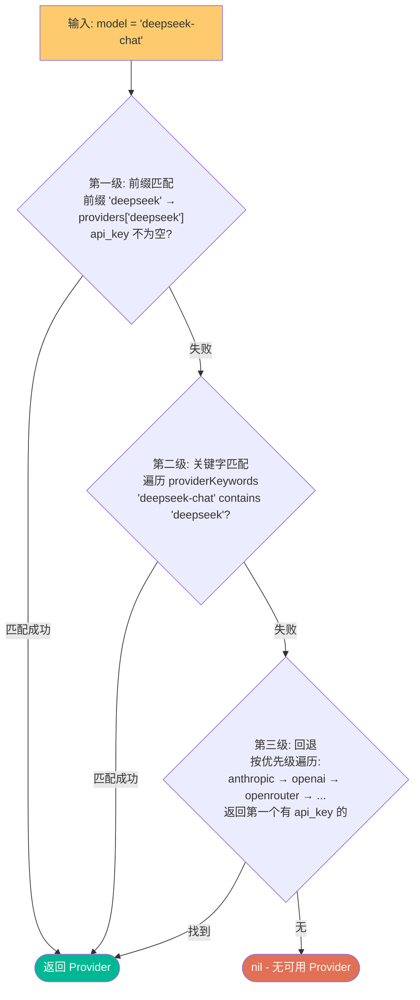

**关键差异：模型名称处理**

```python
# Python 版: LiteLLM 自动添加前缀
# 用户配 "qwen-max" → LiteLLM 收到 "dashscope/qwen-max" → 路由到 DashScope API
actual_model = f"{spec.litellm_prefix}/{model}" if spec.litellm_prefix else model
```

```go
// Go 版: 原样传递，不做任何前缀处理
// 用户配什么就是什么: "deepseek-chat" → API 收到 "deepseek-chat"
actualModel := modelName
```

这是因为 Go 版使用 Eino OpenAI 扩展直接调用 API，不经过 LiteLLM 路由，所以不需要前缀。

### 4.7 技能系统设计

**加载策略（两版一致）：**

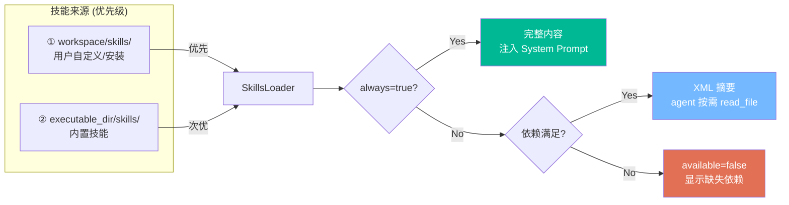

**依赖检查：**

```go
// Go 版
func (l *SkillsLoader) checkRequirements(meta map[string]string) bool {
    // requires_bins: "node,npm" → exec.LookPath("node"), exec.LookPath("npm")
    // requires_env: "BRAVE_API_KEY" → os.Getenv("BRAVE_API_KEY")
}
```

```python
# Python 版: 同样的逻辑
def _check_requirements(self, meta):
    for b in meta.get("requires", {}).get("bins", []):
        if shutil.which(b) is None: return False
```

**OpenClaw 兼容：**

```python
# Python nanobot 兼容 OpenClaw 技能格式
data.get("nanobot", data.get("openclaw", {}))
```

go-nanobot 只识别 `nanobot` 格式的 frontmatter，但由于 ClawHub 上的技能已统一为 nanobot 格式，实际使用不受影响。

---

## 五、Python vs Go 逐模块对比

### 5.1 代码量对比

| 模块 | Python (行) | Go (行) | 比率 |
|------|------------|---------|------|
| CLI / 入口 | 1,124 | 899 | 0.80x |
| Agent Loop | 459 | 485 | 1.06x |
| Context Builder | 253 | 270 | 1.07x |
| Memory | 151 | 248 | 1.64x |
| Skills | 228 | 275 | 1.21x |
| Subagent | 257 | 177 | 0.69x |
| Tools (全部) | ~800 | ~1,400 | 1.75x |
| Provider | 273 + 462 | 308 + 160 | 0.64x |
| Session | ~150 | 189 | 1.26x |
| Channels (全部) | ~3,200 | ~1,600 | 0.50x |
| Config | 367 | 305 + 159 | 1.26x |
| Cron | 367 + 80 | 348 + 73 | 0.94x |
| Bus | ~80 | ~80 | 1.00x |
| **总计** | **~10,370** | **~7,400** | **0.71x** |

> Go 版总行数反而更少，主要是因为渠道实现大多是基础框架（Python 版每个渠道都是完整实现）。如果补齐渠道功能，Go 版预计会达到 ~12,000 行。

### 5.2 语言特性对比

| 特性 | Python | Go |
|------|--------|-----|
| 并发模型 | asyncio (单线程协程) | goroutine (多线程) |
| 错误处理 | try/except | `if err != nil` (显式) |
| 类型系统 | 动态 + type hints | 静态编译 |
| 依赖管理 | pip + requirements.txt | go mod (内置) |
| 配置解析 | Pydantic (自动验证) | yaml.v3 + 手动结构体 |
| JSON 处理 | dict 原生支持 | encoding/json (需 struct tag) |
| 模板字符串 | f-string | fmt.Sprintf |
| 列表操作 | 列表推导 [x for x in ...] | for 循环 |
| 正则 | PCRE (支持反向引用) | RE2 (不支持 `\1`) |
| 部署 | `pip install` + Python runtime | 单二进制文件 |

### 5.3 关键设计决策差异

| 决策点 | Python 版 | Go 版 | 原因 |
|--------|----------|-------|------|
| LLM 调用 | LiteLLM (100+ providers) | Eino OpenAI 扩展 | Go 生态无 LiteLLM |
| Agent 循环 | 手写 while 循环 | Eino ADK Runner | 复用框架能力 |
| Tool 接口 | ABC 抽象类 | Go interface | 语言惯例 |
| 异步 | async/await 全局 | goroutine + channel | 语言原生 |
| 配置验证 | Pydantic 自动 | 手动检查 | Go 无 Pydantic |
| HTML 解析 | `<h([1-6])>...<\/h\1>` | 6 个独立正则 | RE2 不支持 `\1` |
| 日志 | loguru | zap | Go 生态标准 |
| CLI | typer + rich | cobra | Go 生态标准 |

---

## 六、go-nanobot 的独特优势

### 6.1 单二进制部署

```bash
# 编译
go build -o nanobot .

# 部署到任何 Linux/Mac 服务器
scp nanobot server:/usr/local/bin/
ssh server "nanobot gateway"

# 无需安装 Python、pip、virtualenv、依赖包
```

### 6.2 更低的资源占用

- **内存**：Go 编译后的二进制通常比 Python 进程内存占用低 3-5 倍
- **启动速度**：毫秒级启动 vs Python 的秒级（导入模块）
- **CPU**：Go 原生并发，无 GIL 限制

### 6.3 原生并发安全

```go
// Go 版：编译器保证的并发安全
type AgentLoop struct {
    consolidateMu sync.Mutex  // 防止并发合并
}

type Manager struct {
    mu sync.RWMutex  // 读写锁保护 session 缓存
}
```

Python 版依赖 asyncio.Lock（单线程内有效），但在多线程场景下需要额外注意。

### 6.4 交叉编译

```bash
# 一条命令编译所有平台
GOOS=linux GOARCH=amd64 go build -o nanobot-linux
GOOS=darwin GOARCH=arm64 go build -o nanobot-mac
GOOS=windows GOARCH=amd64 go build -o nanobot.exe
```

---

## 七、系统 Prompt 构建详解

System Prompt 是 Agent 的"灵魂"，决定了 AI 助手的行为。两版构建方式一致：

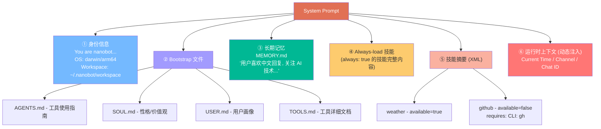

---

## 八、三代项目特性对比总览

| 特性 | OpenClaw (小龙虾) | nanobot (Python) | go-nanobot (Go) |
|------|-------------------|------------------|-----------------|
| **代码量** | 430,000+ 行 | ~4,000 行核心 | ~7,400 行 |
| **语言** | Python (多模块) | 纯 Python | 纯 Go |
| **部署** | Docker Compose | pip install | 单二进制 |
| **LLM 框架** | 自研 | LiteLLM | Eino ADK |
| **Provider 数** | 10+ | 17+ | 17+ |
| **渠道数** | 9+ | 9 | 9 (框架级) |
| **浏览器自动化** | 完整 | 无 | 无 |
| **代码沙箱** | Docker 隔离 | Shell + 安全正则 | Shell + 安全正则 |
| **MCP 支持** | 完整 | stdio + HTTP | stdio + HTTP |
| **技能系统** | 完整商店 + 运行时 | Markdown + Shell | Markdown + Shell |
| **记忆系统** | 完整 (向量+文本) | 双层 (MEMORY+HISTORY) | 双层 (MEMORY+HISTORY) |
| **心跳服务** | 完整 | 虚拟工具调用 | 基础轮询 |
| **OAuth Provider** | 支持 | Codex + Copilot | 无 |
| **Prompt Caching** | 支持 | Anthropic 原生 | Header 注入 |
| **进度流** | 完整 | 完整 | 完整 |
| **配置验证** | 分层 | Pydantic 自动 | YAML 手动 |
| **日志** | 自研 | loguru | zap |
| **单元测试** | 完整 | 部分 | 无 |

---

## 九、技术选型思考

### 9.1 为什么选择 Eino ADK？

在 Go 生态中，缺少 LiteLLM 这样的统一 LLM 网关。可选方案有：

| 方案 | 优点 | 缺点 |
|------|-----|------|
| 直接调用 OpenAI API | 简单 | 每个 Provider 要写一套 |
| langchaingo | 成熟社区 | 过重，抽象层太多 |
| **Eino ADK** | 字节背书，ADK 内置 Agent 循环 | 相对新，社区较小 |
| 自研 | 完全可控 | 维护成本高 |

最终选择 Eino 的原因：
1. **ADK Agent 模式**内置了 tool calling 循环，省去大量代码
2. OpenAI 兼容扩展 (`eino-ext/components/model/openai`) 天然支持所有兼容接口
3. 字节 Cloudwego 开源体系，长期维护有保障

### 9.2 为什么 Go 版代码量反而比 Python 多？

1. **显式错误处理**：每个函数调用后都有 `if err != nil`（Python 用 try/except 集中处理）
2. **无列表推导**：Python 的 `[x.name for x in tools]` 在 Go 中是 4 行 for 循环
3. **结构体声明**：Go 的 struct + YAML tag 比 Python dataclass 更冗长
4. **正则差异**：RE2 不支持反向引用，需要拆分为 6 个独立正则
5. **适配器层**：nanobot Tool → Eino BaseTool 的适配代码

但这些"冗长"换来了：
- 编译时类型安全
- 更好的 IDE 补全和重构支持
- 更可预测的运行时行为
- 零依赖部署

---

## 十、总结

go-nanobot 展示了一个有趣的工程实践：**将一个精心设计的 Python AI Agent 框架跨语言复刻到 Go**。这个过程中的关键洞察：

1. **Agent 框架的核心是协议，不是语言**。消息总线、工具接口、Provider 匹配、记忆管理——这些都是与语言无关的设计模式，可以 1:1 映射。

2. **LLM 抽象层的选择决定架构**。Python 有 LiteLLM 这个"瑞士军刀"，Go 则需要 Eino ADK 来填补空白。工具链的差异迫使某些实现路径不同，但目标一致。

3. **"用 4000 行代码做到 99%"的理念在 Go 中同样成立**。虽然代码量从 4K 增长到 7.4K，但架构依然极简，功能完全对齐。

4. **从 OpenClaw 430K → nanobot 4K → go-nanobot 7.4K 的演化表明**：AI Agent 的真正复杂度在 LLM 本身，框架要做的就是搭好脚手架、做好安全护栏、管好状态流转。

---

*本文基于 go-nanobot 和 nanobot 的源码分析撰写，代码仓库：*
- *go-nanobot: https://github.com/yangkun19921001/PP-Claw*
- *nanobot: https://github.com/HKUDS/nanobot*
- *OpenClaw: https://github.com/openclaw/openclaw*
