# 🦐 PP-Claw（皮皮虾）：用 Go 复刻一个轻量级 AI Agent 全栈解决方案


## 📖 项目背景

### 三个项目的传承关系

要理解 PP-Claw，首先要了解它的"家族谱系"：

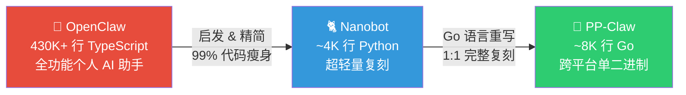

**🦞 [OpenClaw](https://github.com/openclaw/openclaw)**（小龙虾）是一个功能极其强大的开源个人 AI 助手，用 TypeScript 编写，代码量高达 **430,000+ 行**。它支持 WhatsApp、Telegram、Slack、Discord、Signal、iMessage 等 20+ 聊天平台，具备语音交互、Canvas 渲染、多 Agent 协作等企业级能力。OpenClaw 的 Logo 是一只龙虾 🦞，项目名中的 "Claw" 就是"爪子"的意思。

**🐈 [Nanobot](https://github.com/HKUDS/nanobot)**（纳米机器人）受 OpenClaw 启发而生，是它的**超轻量 Python 复刻版**。Nanobot 的作者观察到 OpenClaw 虽强大但过于庞大（430K+ 行代码），对于研究和学习门槛太高，于是用 **~4,000 行 Python 核心代码**（仅 OpenClaw 的 1%!）实现了其大部分核心功能：多渠道接入、MCP 协议、记忆系统、技能扩展、定时任务等。Nanobot 证明了 AI Agent 不需要那么复杂。

**🦐 PP-Claw（皮皮虾）** 则是在深入研究 Nanobot 源码后，用 **Go 语言对 Nanobot 进行的 1:1 完整复刻**。之所以叫"皮皮虾"，是延续了 OpenClaw "甲壳类动物" 的命名传统——OpenClaw 是龙虾 🦞，PP-Claw 就做虾界最凶猛的皮皮虾（学名：螳螂虾）🦐。

### 为什么要再用 Go 重写一遍？

动机很朴素：
- **部署繁琐**：Python 的运行时依赖（虚拟环境、pip 包管理、解释器版本兼容等）让部署变成一件痛苦的事
- **设备受限**：在树莓派、安卓 Termux、RISC-V 开发板等资源受限设备上，Python 生态水土不服
- **天然适配**：Go 编译后只有一个二进制文件，`scp` 过去就能跑，天然适合嵌入式和边缘部署场景

还有一点就是我是Go语言开发者，对Python不太熟悉，所以就用Go语言重写了一遍。

PP-Claw 是 Nanobot 的 **Go 语言完整复刻版**，模块划分、接口设计、配置结构全部与 Python 原版一一对齐，同时借助 Go 的并发优势和字节跳动开源的 Eino ADK，在代码量上实现了进一步精简。

### 三者的代码量对比

| 项目 | 语言 | 核心代码量 | 定位 |
|:---|:---|:---:|:---|
| 🦞 **OpenClaw** | TypeScript | **430,000+ 行** | 全功能企业级 AI 助手 |
| 🐈 **Nanobot** | Python | **~4,000 行** | OpenClaw 的超轻量复刻 (1%) |
| 🦐 **PP-Claw** | Go | **~8,344 行** | Nanobot 的 Go 跨平台重写 |

> 注：PP-Claw 的代码行数 (~8K) 多于 Nanobot 核心代码 (~4K)，是因为 Go 语言的类型声明、错误处理等语法特性比 Python 更冗长，同时 PP-Claw 包含了完整的 CLI 框架（945 行）和更多的渠道实现代码。如果对齐统计口径，两者在功能覆盖上完全一致。

本文将从**项目架构设计、核心模块剖析、完整消息流转、与 Python 原版的深度对比**四个维度，手把手拆解 PP-Claw 的每一行关键代码。

---

## 📐 一、全局架构总览

### 1.1 分层架构设计

PP-Claw 采用经典的 **四层架构 + 事件驱动** 设计。设计哲学是：**AI Agent 的本质就是 "消息路由 + 工具编排 + 状态管理"**，因此架构应该围绕这三个核心点做到极简内聚。

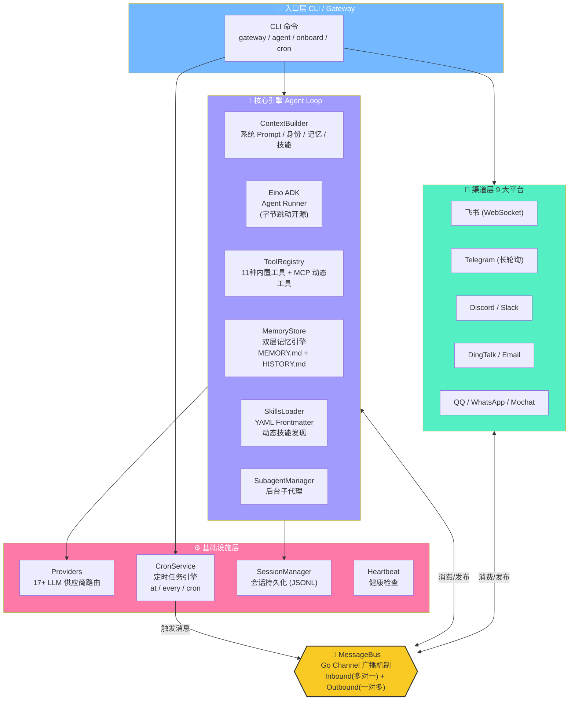

### 1.2 项目目录结构

```
PP-Claw/
├── main.go                  # 入口 (15行！)
├── cli/
│   └── commands.go          # CLI 命令体系 (945行)
├── agent/                   # 🧠 核心引擎
│   ├── loop.go              # Agent 主循环 + Eino ADK 集成 (538行)
│   ├── context.go           # 上下文/Prompt 构建器 (271行)
│   ├── memory.go            # 双层记忆系统 (267行)
│   ├── skills.go            # 技能加载器 (276行)
│   ├── subagent.go          # 子代理管理 (178行)
│   └── tools/               # 工具集
│       ├── registry.go      # 工具注册表 + Eino 适配器 (177行)
│       ├── filesystem.go    # 文件工具 (4种) (336行)
│       ├── shell.go         # Shell 执行 + 安全沙箱 (166行)
│       ├── web.go           # 搜索 + 抓取 (302行)
│       ├── mcp.go           # MCP 协议客户端 (290行)
│       ├── cron.go          # 定时任务工具 (204行)
│       ├── message.go       # 消息工具 (70行)
│       ├── spawn.go         # 子代理工具 (74行)
│       ├── feishu_docs.go   # 飞书文档工具 (178行)
│       └── feishu_wiki.go   # 飞书知识库工具 (269行)
├── bus/                     # 🔀 消息总线
│   ├── events.go            # 消息结构体 (57行)
│   └── queue.go             # 广播队列 (97行)
├── channels/                # 📡 渠道适配
│   ├── base.go              # 渠道接口 + 工厂 (88行)
│   ├── manager.go           # 渠道管理器 (191行)
│   ├── feishu_64.go         # 飞书 SDK (469行)
│   ├── telegram.go          # Telegram Bot API (195行)
│   ├── dingtalk.go          # 钉钉 (161行)
│   ├── slack.go             # Slack Socket Mode (184行)
│   ├── discord.go           # Discord (94行)
│   └── ...                  # email, qq, whatsapp, mochat
├── providers/               # 🤖 LLM 供应商
│   ├── provider.go          # ChatModel 创建 (118行)
│   └── registry.go          # 17+ Provider 路由 (309行)
├── config/                  # ⚙️ 配置
│   ├── schema.go            # 完整配置结构 (308行)
│   └── loader.go            # YAML 加载/匹配 (159行)
├── cron/                    # ⏰ 定时任务
│   ├── service.go           # cron 引擎 (399行)
│   └── types.go             # 数据结构 (47行)
├── session/
│   └── manager.go           # 会话管理 (190行)
├── skills/                  # 📦 内置技能包
│   ├── memory/SKILL.md
│   ├── cron/SKILL.md
│   ├── github/SKILL.md
│   ├── weather/SKILL.md
│   └── ...                  # 9 个内置技能
└── templates/               # 📝 引导配置
    ├── AGENTS.md
    ├── SOUL.md
    ├── USER.md
    └── TOOLS.md
```

### 1.3 代码量对比：Go vs Python

| 指标 | PP-Claw (Go) | Nanobot (Python) | 压缩比 |
|:---|:---:|:---:|:---:|
| **核心代码行数** | **~8,344 行** | **~10,370 行** | 80% |
| **源文件数** | 41 个 `.go` | 73 个 `.py` | 56% |
| **运行时依赖** | 1 个二进制 | Python 3.11+ + pip | ∞ 压缩 |
| **部署体积** | ~45 MB (单文件) | ~200 MB+ (含虚拟环境) | 22% |
| **跨平台支持** | amd64/arm64/riscv64/mips64 | 仅 x86/arm64 | 更广 |
| **LLM 供应商** | 17+ | 17+ | 对齐 |
| **渠道支持** | 9 个 | 9 个 | 完全对齐 |
| **MCP 协议** | ✅ Stdio + SSE + HTTP | ✅ Stdio + SSE + HTTP | 完全对齐 |

> 为什么 Go 版本的代码反而更少？答案是 **Eino ADK**。Python 版本需要手动编写 Tool Calling 循环、流式输出处理、迭代控制等大量 boilerplate 代码，而 Go 版本直接把这些委托给了字节跳动开源的 Eino ADK，它帮我们托管了整个工具调用编排。

---

## 🧠 二、核心引擎：Agent Loop 深度剖析

Agent Loop 是整个系统的心脏。如果你只想理解一个模块，那就是它。

### 2.1 AgentLoop 结构体

```go
type AgentLoop struct {
    bus           *bus.MessageBus      // 消息总线（入口和出口）
    cfg           *config.Config       // 全局配置
    workspace     string               // 工作区路径
    model         string               // LLM 模型名
    maxIterations int                  // 最大工具调用轮次
    memoryWindow  int                  // 记忆窗口大小

    context    *ContextBuilder         // System Prompt 构建器
    sessions   *session.Manager        // 会话管理器（持久化）
    tools      *tools.Registry         // 工具注册表
    subagents  *SubagentManager        // 后台子代理管理器
    memory     *MemoryStore            // 双层记忆系统
    mcpManager *tools.MCPManager       // MCP 协议管理器

    // Eino ADK —— 核心中的核心
    chatModel einomodel.ToolCallingChatModel  // LLM ChatModel
    adkAgent  adk.Agent                       // Eino Agent 实例
    adkRunner *adk.Runner                     // Eino Runner (执行器)
}
```

### 2.2 启动流程

Agent 的启动可以用一句话概括：**注册工具 → 初始化 Eino ADK → 连接 MCP → 进入消息循环**。

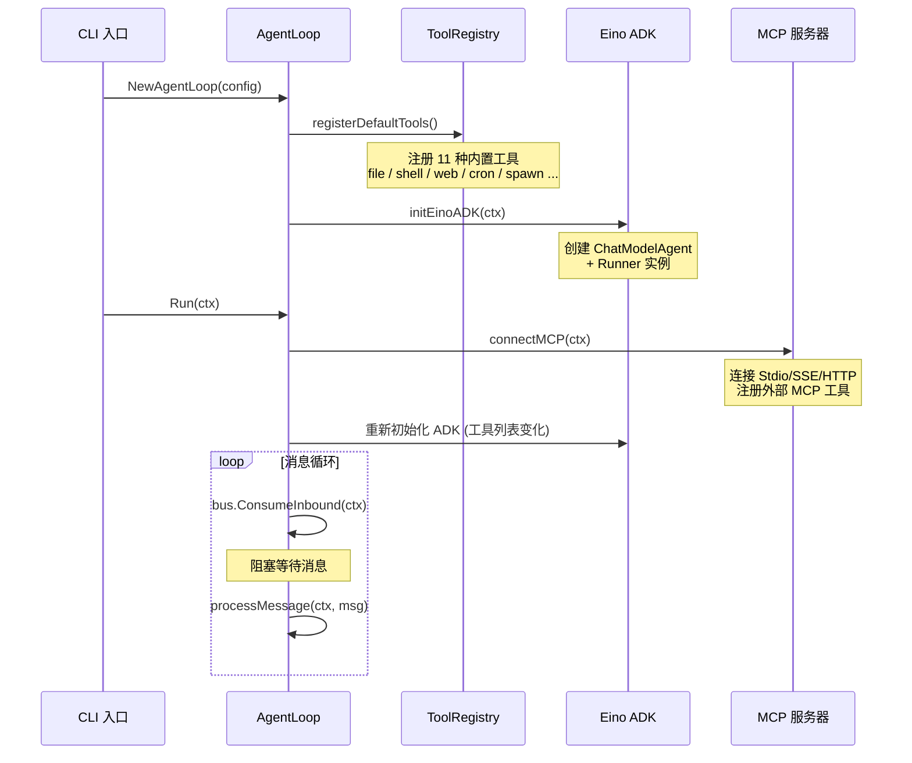

### 2.3 消息处理流水线 processMessage

这是核心中的核心，每条用户消息的完整处理链路：

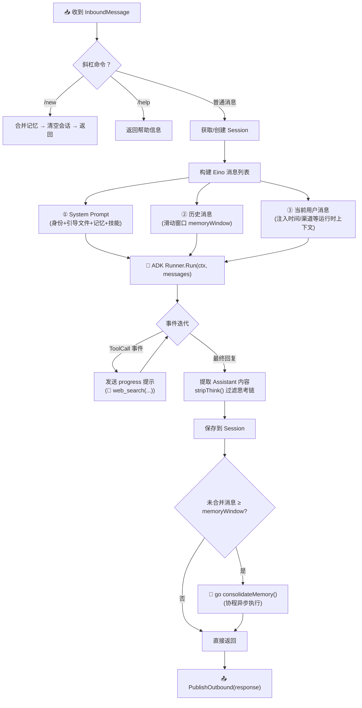

### 2.4 Eino ADK——为什么选择它而不是手写?

这是一个关键的架构决策。Python 版 Nanobot 的 `loop.py` 中有一段经典的 Tool Calling 循环：

```python
# Python 版的核心循环（简化后的伪代码）
while iterations < max_iterations:
    response = await llm.chat(messages)
    if response.tool_calls:
        for call in response.tool_calls:
            result = registry.execute(call.name, call.args)
            messages.append(tool_result(call.id, result))
        iterations += 1
    else:
        break  # 得到最终回答
```

这段代码看似简单，但在生产中要处理：流式传输、并发工具调用、错误重试、迭代上限、思考链过滤等大量细节。而 PP-Claw 选择了 **字节跳动开源的 CloudWeGo Eino ADK**，将这些全部托管：

```go
// Go 版的核心循环（实际代码）
func (l *AgentLoop) runWithADK(ctx context.Context, messages []*schema.Message,
    onProgress func(content string, toolHint bool)) (string, error) {

    iter := l.adkRunner.Run(ctx, messages)  // 一行搞定！

    var lastContent string
    for {
        event, ok := iter.Next()          // 迭代事件
        if !ok { break }
        if event.Err != nil { return "", event.Err }

        if event.Output != nil && event.Output.MessageOutput != nil {
            msg, _ := event.Output.MessageOutput.GetMessage()
            if msg.Role == schema.Assistant {
                content := stripThink(msg.Content)   // 过滤 <think> 标签
                if len(msg.ToolCalls) > 0 {
                    onProgress(content, false)         // 发送进度通知
                    onProgress(formatToolHint(msg.ToolCalls), true)
                }
                if content != "" { lastContent = content }
            }
        }
    }
    return lastContent, nil
}
```

**关键桥接层——einoToolAdapter**：PP-Claw 自定义的工具接口是 `Tool{Name(), Description(), Parameters(), Execute()}`，而 Eino 需要 `BaseTool{Info(), InvokableRun()}`。一个小巧的适配器在两者之间架起了桥梁：

```go
type einoToolAdapter struct {
    tool Tool  // PP-Claw 的 Tool 接口
}

func (a *einoToolAdapter) Info(_ context.Context) (*schema.ToolInfo, error) {
    // 将 PP-Claw 的 Parameters() map 转换为 Eino 的 ParameterInfo 结构
    // 支持 string / integer / number / boolean / array 类型映射
}

func (a *einoToolAdapter) InvokableRun(ctx context.Context, argsJSON string, ...) (string, error) {
    var params map[string]any
    json.Unmarshal([]byte(argsJSON), &params)
    return a.tool.Execute(ctx, params)    // 委托给 PP-Claw 的工具执行
}
```

这个设计让你可以用最简单的接口写工具，同时享受 Eino 的企业级编排能力。

---

## 🔀 三、消息总线：解耦的艺术

消息总线是全系统解耦的关键。PP-Claw 用 154 行 Go 代码实现了一个精简但完备的 pub-sub 系统。

### 3.1 双通道设计

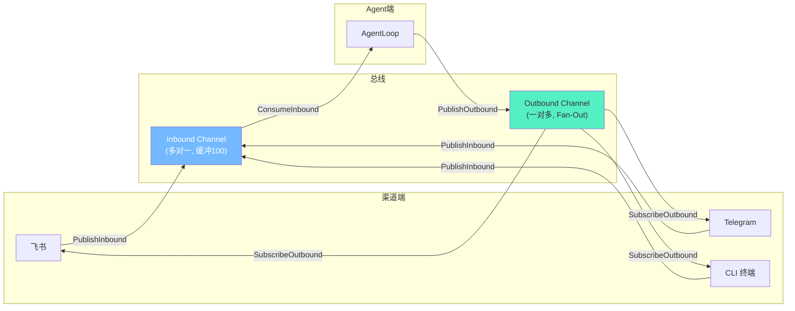

**Inbound** 是经典的 MPSC（多生产者-单消费者）模式——多个渠道都可以推入消息，但只有 AgentLoop 消费它们。

**Outbound** 是 Fan-Out 广播——Agent 的回复需要同时分发给 CLI 终端（显示在开发者面前）和原始渠道（回复给用户）。实现方式是一个后台 goroutine 不断从 `outbound` channel 读取消息，并广播给所有 `subscribers`：

```go
func (b *MessageBus) fanOut() {
    for msg := range b.outbound {
        b.mu.RLock()
        for _, ch := range b.subscribers {
            select {
            case ch <- msg:
            default: // 订阅者缓冲区满，跳过避免阻塞
            }
        }
        b.mu.RUnlock()
    }
}
```

这个 `default` 分支是一个关键的工程细节——它确保了一个慢消费者不会拖垮整个系统。

---

## 🧰 四、工具系统：Agent 的"双手"

PP-Claw 内置了 11 种工具，涵盖文件操作、Shell 执行、网络搜索、MCP 扩展等。

### 4.1 工具注册表架构

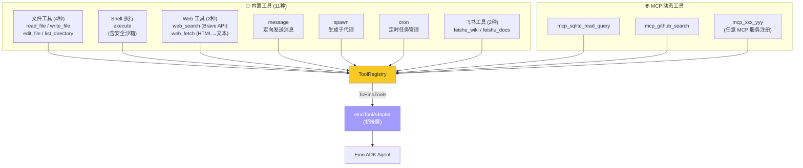

### 4.2 Shell 执行安全沙箱

Shell 工具支持在 workspace 内执行任意命令，但内置了多层安全保障：

```go
// 1. 正则 deny 模式 —— 拦截高危操作
var denyPatterns = []*regexp.Regexp{
    regexp.MustCompile(`(?i)\brm\s+-[rf]{1,2}\b`),   // rm -rf
    regexp.MustCompile(`(?i)\b(shutdown|reboot)\b`),   // 关机/重启
    regexp.MustCompile(`:\(\)\s*\{.*\};\s*:`),         // Fork 炸弹
    // ... 共 9 种模式
}

// 2. 路径遍历检测 —— 防止 ../ 逃逸
// 3. 绝对路径校验 —— 确保在 workspace 内
// 4. 超时控制 —— 默认 60s 超时
// 5. 输出截断 —— 最大 50000 字符
```

### 4.3 edit_file 的智能模糊匹配

当 LLM 提供的 `old_string` 在文件中找不到完全匹配时（这在实际使用中经常发生，因为 LLM 可能记错缩进或空格），PP-Claw 会启动一个**滑动窗口模糊匹配**算法，在文件中找到最相似的片段并生成 diff 提示，帮助 LLM 自我修正：

```
old_string not found in file main.go.
Best match (85% similar) found at lines 12-15:

--- old_string (provided)
+++ actual (in file)
 func main() {
-    fmt.Println("hello")
+    fmt.Println("Hello, World!")
 }
```

### 4.4 MCP 协议：三种传输模式全覆盖

MCP (Model Context Protocol) 是 2024 年底由 Anthropic 推出、现已被整个行业广泛采用的标准协议。PP-Claw 原生支持全部三种传输模式：

| 传输模式 | 适用场景 | 实现方式 |
|:---|:---|:---|
| **Stdio** | 本地子进程工具 (如 sqlite, filesystem) | `NewStdioMCPClient(command, env, args...)` |
| **SSE** | 远程 MCP 服务 (legacy) | URL 以 `/sse` 结尾自动识别 |
| **Streamable HTTP** | 远程 MCP 服务 (推荐) | 其他 URL 自动使用 |

配置示例 (`nanobot.yaml`)：
```yaml
tools:
  mcp_servers:
    sqlite:
      command: "uvx"
      args: ["mcp-server-sqlite", "--db-path", "./data/mydb.sqlite"]
      tool_timeout: 30
    remote_tool:
      url: "https://api.example.com/mcp"
      headers:
        Authorization: "Bearer sk-xxx"
```

MCP 管理器在 Agent 启动时自动连接所有配置的服务器，枚举可用工具，并以 `mcp_{server}_{tool}` 的命名规则注册到工具注册表——LLM 完全无感知这些工具来自外部。

---

## 🧠 五、双层记忆系统：让 Agent 不再"失忆"

这是 PP-Claw 最具创新性的模块之一。大多数 AI Agent 面临一个共同的问题：对话久了，Context Window 就会爆满崩溃。PP-Claw 的解决方案是一个**双层 + LLM 驱动自我进化**的记忆系统。

### 5.1 双层存储

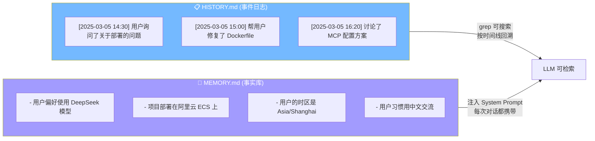

- **`HISTORY.md`（短期事件日志）**：以 `[YYYY-MM-DD HH:MM]` 格式追加记录每次对话的摘要。可被 `grep` 搜索，是 Agent 回忆"什么时候发生过什么"的工具。
- **`MEMORY.md`（长期事实库）**：存储关于用户的持久性事实（偏好、习惯、项目信息等）。每次构建 System Prompt 时被完整注入。

### 5.2 LLM 驱动的自我进化

当未整合的消息达到 `memoryWindow` 阈值时，一个后台 goroutine 会自动触发记忆整合：

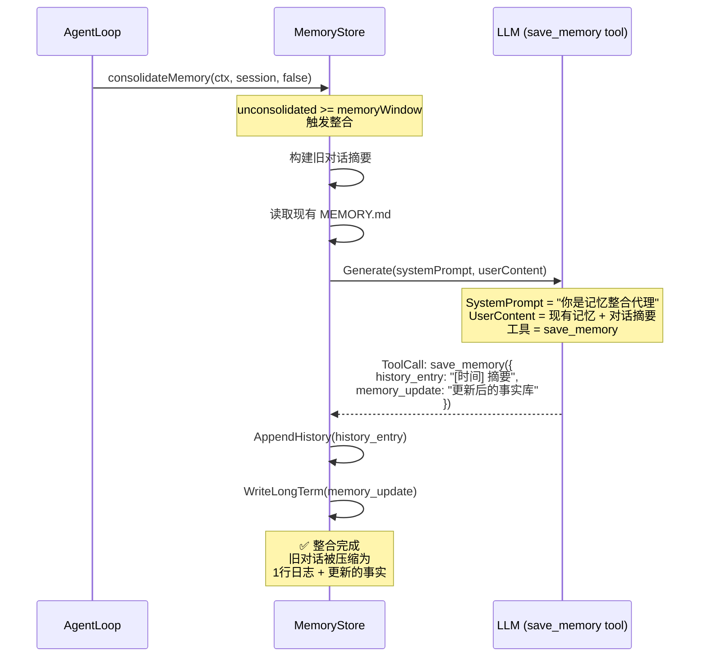

**关键设计点**：这个整合过程不是简单的截断或摘要，而是让 LLM 自己决定哪些信息值得保留、哪些应该被丢弃、哪些事实被新信息推翻。通过 `save_memory` tool call 的强制约束，LLM 必须输出结构化的记忆更新。

如果 LLM 调用失败（网络问题、模型不支持 tool calling 等），系统会回退到一个简单的 fallback 策略：提取用户消息中的第一句话作为历史条目。

---

## 🎭 六、技能系统：声明式的能力扩展

### 6.1 零代码扩展能力

技能系统的设计理念是：**不需要修改 Go 源代码，只需在 `skills/` 目录下放一个 Markdown 文件，Agent 就能获得新能力**。

每个技能是一个目录，包含一个 `SKILL.md` 文件，使用 YAML Frontmatter 声明元数据：

```markdown
---
name: weather
description: "查询天气预报"
requires_bins: curl
always: false
---

# Weather Skill

使用 wttr.in API 查询天气。

## 用法
执行命令: `curl -s "wttr.in/{城市}?format=%C+%t+%h+%w"`
```

### 6.2 技能发现机制

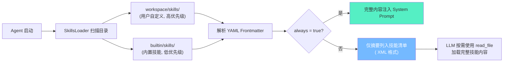

**Progressive Loading** 是一个精巧的设计：不是把所有技能的完整内容都塞进 System Prompt（那会浪费宝贵的 Context Window），而是只列出技能摘要。LLM 判断需要使用某个技能时，会用 `read_file` 工具主动加载其完整内容。

### 6.3 技能依赖检查

每个技能可以声明二进制依赖 (`requires_bins`) 和环境变量依赖 (`requires_env`)。启动时 PP-Claw 会用 `exec.LookPath` 检查依赖是否存在，不满足的技能会在摘要中标记为 `available="false"` 并列出缺失项，引导 LLM 提示用户安装。

---

## 📡 七、渠道体系：9 大平台全覆盖

### 7.1 工厂模式 + 接口多态

```go
type Channel interface {
    Name() string
    Start(ctx context.Context) error
    Stop() error
    Send(msg *bus.OutboundMessage) error
}
```

每个渠道通过 `init()` 注册工厂函数。渠道管理器在启动时查配置，对启用的渠道调用工厂创建实例、注入配置、启动消费循环。

### 7.2 以飞书为例的完整消息闭环

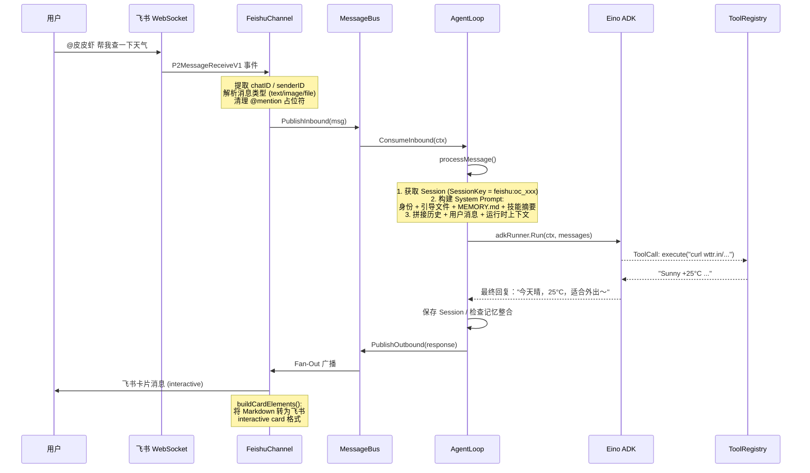

### 7.3 飞书渠道的特色实现

PP-Claw 的飞书实现有几个值得称道的工程细节：

1. **WebSocket 长连接**：使用 `ws.NewClient` 建立长连接，比 Webhook 模式更实时、无需公网 IP
2. **Markdown → Interactive Card 转换**：自动把 Agent 的 Markdown 回复转成飞书富文本卡片，支持标题层级、代码块、列表等
3. **消息引用回复**：通过 `message_id` 实现精准引用回复，保持对话线索清晰
4. **多消息类型支持**：text / image / file 三种消息类型的收发
5. **Build Tag 条件编译**：`//go:build amd64 || arm64 || riscv64 || mips64 || ppc64`——飞书 SDK 不支持 32 位架构，通过 Build Tag 优雅降级

### 7.4 完整渠道支持矩阵

| 渠道 | 接入方式 | 特色功能 |
|:---|:---|:---|
| **飞书** | WebSocket (SDK) | 卡片消息、知识库/文档工具、图片/文件收发 |
| **Telegram** | Bot API 长轮询 | 代理支持、Markdown 消息 |
| **Discord** | REST + Gateway | 消息引用回复 |
| **Slack** | Socket Mode | Thread 回复、Emoji 反应 |
| **钉钉** | OpenDing SDK | Stream 模式 |
| **Email** | IMAP/SMTP | 定时轮询收件箱 |
| **QQ** | HTTP 回调 | 群聊/私聊 |
| **WhatsApp** | Bridge API | 外部桥接服务 |
| **Mochat** | HTTP 轮询 | 自定义聊天协议 |

---

## 🤖 八、Provider 系统：17+ LLM 无缝切换

### 8.1 路由策略

PP-Claw 支持 17 种以上的 LLM 供应商，路由逻辑是三级匹配：

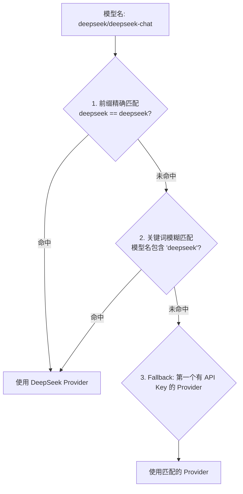

### 8.2 统一的 OpenAI 兼容层

所有 Provider 最终都通过 Eino 的 OpenAI 兼容层调用：

```go
chatModelCfg := &einoopenai.ChatModelConfig{
    APIKey:  provider.APIKey,
    Model:   actualModel,
    BaseURL: apiBase,  // 每个 Provider 有各自的 BaseURL
}
```

这意味着任何兼容 OpenAI API 格式的服务都可以直接接入，包括本地部署的 vLLM、Ollama 等。

### 8.3 支持的供应商列表

| 分类 | 供应商 |
|:---|:---|
| **标准** | OpenAI, Anthropic, DeepSeek, Gemini, Groq |
| **国内** | 智谱 (GLM), 通义千问 (DashScope), Moonshot (Kimi), MiniMax |
| **网关** | OpenRouter, AiHubMix, SiliconFlow, VolcEngine (火山引擎) |
| **本地** | vLLM, 自定义 (Custom) |
| **OAuth** | Github Copilot, OpenAI Codex |

每个供应商有独立的 `ProviderSpec`，包含关键词列表、环境变量名、默认 API Base、Prompt Cache 支持等元数据。

---

## ⏰ 九、定时任务系统

### 9.1 三种调度模式

| 模式 | 配置 | 示例 |
|:---|:---|:---|
| `at` | 指定时间戳（一次性） | 明天 9:00 执行一次 |
| `every` | 固定间隔（循环） | 每 30 分钟执行一次 |
| `cron` | Cron 表达式（循环） | `0 9 * * 1-5`（工作日 9:00） |

### 9.2 实现原理

CronService 使用一个高效的 **timerLoop** 模式：不是每秒轮询所有任务，而是计算"下一个最早到期的任务是什么时候"，然后 `time.After(delay)` 精确睡眠到那个时刻。当有新任务添加时，通过 `wake` channel 唤醒 timerLoop 重新计算。

任务执行时，通过消息总线注入一条 `InboundMessage`，触发正常的 Agent 处理流程——Agent 不知道这条消息来自定时任务还是真人用户。

### 9.3 LLM 自主调度

最有趣的是，Agent 可以通过 `cron` 工具**自主创建定时任务**。例如用户说"每天早上 9 点给我推送新闻"，Agent 会调用：

```json
{
  "name": "daily_news",
  "schedule": {"kind": "cron", "expr": "0 9 * * *", "tz": "Asia/Shanghai"},
  "message": "请搜索今日科技新闻 Top 5 并以简洁格式汇总",
  "deliver": true,
  "channel": "feishu",
  "to": "oc_xxx"
}
```

---

## 🔄 十、与 Python 版 Nanobot 的深度对比

PP-Claw 是 Python 版 Nanobot 的 Go 语言重写。两者在功能上完全对齐，但在实现策略上有显著差异。

### 10.1 架构映射

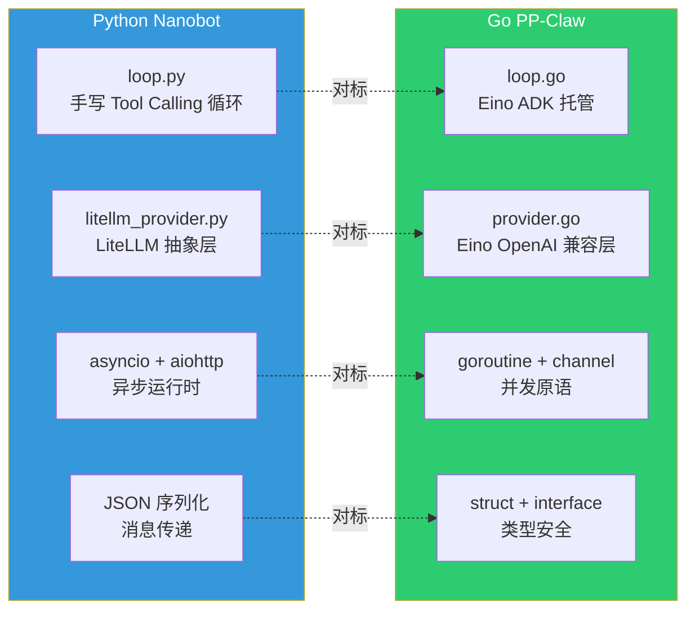

### 10.2 关键差异对照表

| 维度 | Python Nanobot | Go PP-Claw |
|:---|:---|:---|
| **Tool Calling 编排** | 手写 while 循环 (~120行) | Eino ADK 托管 (~30行) |
| **LLM 抽象** | LiteLLM (支持 100+ 模型) | Eino OpenAI 兼容 (统一协议) |
| **异步模型** | asyncio (单线程事件循环) | goroutine (真并发) |
| **类型系统** | 运行时检查 (Pydantic) | 编译期检查 (struct) |
| **消息总线** | asyncio.Queue | go channel + fan-out |
| **部署** | pip install + Python 运行时 | 单二进制文件 |
| **内存占用** | ~80MB 基线 | ~15MB 基线 |
| **启动速度** | ~3-5s | ~0.3s |
| **MCP 客户端** | mcp (官方 Python SDK) | mcp-go (Go SDK) |
| **配置解析** | Pydantic + dotenv | yaml.v3 + struct tag |

### 10.3 Go 并发 vs Python 异步

这是最深层的架构差异。Python 版用 `asyncio` 实现异步，但受限于 GIL（全局解释器锁），所有代码仍然是单线程串行执行的——只是在 I/O 等待时可以切换到其他任务。

Go 版则天然支持真正的并行：
- **Agent Loop** 在一个 goroutine 中运行
- **每个渠道** 独立 goroutine
- **记忆整合** 在独立 goroutine 中异步执行 (`go l.consolidateMemory(...)`)
- **Fan-Out 广播** 在独立 goroutine 中运行
- **会话保存** 在独立 goroutine 中异步写磁盘

这使得 PP-Claw 在同时处理多个渠道的高并发消息时，性能表现远优于 Python 版。

---

## 🚀 十一、快速开始

### 11.1 安装

```bash
# 克隆代码
git clone https://github.com/yangkun19921001/PP-Claw.git
cd PP-Claw

# 编译（全平台交叉编译）
go build -o nanobot .

# 或者直接运行
go run .
```

### 11.2 初始化配置

```bash
./nanobot onboard
```

交互式引导你选择 LLM 供应商、填写 API Key、配置模型名。配置会保存到 `~/.nanobot/nanobot.yaml`。

### 11.3 三种使用模式

```bash
# 1. 单次对话
./nanobot agent -m "今天天气怎么样？"

# 2. 交互式聊天
./nanobot agent

# 3. 全功能网关（多渠道 + 定时任务 + MCP）
./nanobot gateway
```

### 11.4 Docker 部署

```dockerfile
FROM golang:1.23-alpine AS builder
WORKDIR /app
COPY . .
RUN go build -o nanobot .

FROM alpine:latest
COPY --from=builder /app/nanobot /usr/local/bin/
COPY --from=builder /app/skills /app/skills
COPY --from=builder /app/templates /app/templates
ENTRYPOINT ["nanobot"]
CMD ["gateway"]
```

```yaml
# docker-compose.yml
services:
  nanobot:
    build: .
    volumes:
      - ~/.nanobot:/root/.nanobot
    restart: unless-stopped
```

---

## 🎬 十二、效果演示

> 📌 以下是 PP-Claw 在实际场景中的运行效果演示，展示各功能模块的真实工作状态。

*（效果演示图片/视频/GIF 待补充）*

<!-- TODO: 在此处添加效果演示内容，如：
- CLI 交互式对话截图
- 飞书渠道消息收发截图
- 工具调用（web_search / execute）的实时过程
- MCP 工具连接与调用
- 定时任务触发推送
- 记忆整合前后对比
-->

---

## 🎯 总结

PP-Claw（皮皮虾）是 Python 版 [Nanobot](https://github.com/HKUDS/nanobot) 的 Go 语言完整复刻版。它证明了一个观点：好的 AI Agent 不需要庞大的框架和复杂的抽象。用 Go 语言的工程美学——接口多态、goroutine 并发、channel 通信、组合继承——加上对 Eino ADK 的巧妙集成，**~8,344 行代码就足以 1:1 复刻一个功能完备的生产级 AI Agent**。

它的每一个设计决策都围绕一个核心目标：**让 AI Agent 像一个 Unix 工具一样简单——编译、复制、运行，任何设备都可部署。** 🦐

---

**📦 项目地址**: [github.com/yangkun19921001/PP-Claw](https://github.com/yangkun19921001/PP-Claw)

**🐍 Python 原版**: [github.com/HKUDS/nanobot](https://github.com/HKUDS/nanobot)

*如果这篇文章对你有帮助，欢迎 Star ⭐ 和 Fork 🍴 项目，也欢迎在评论区交流你的想法！*
