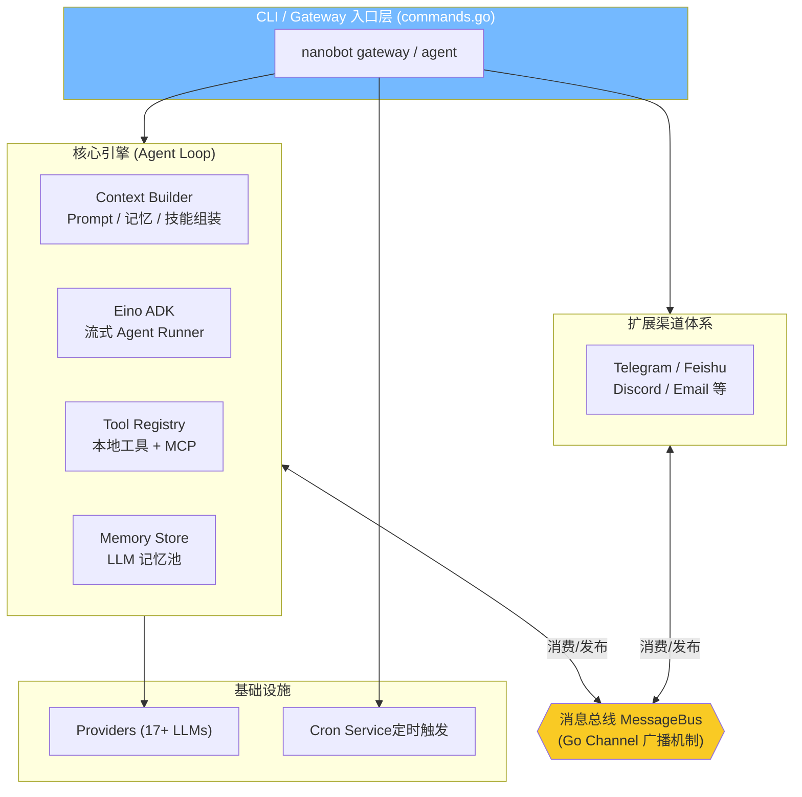
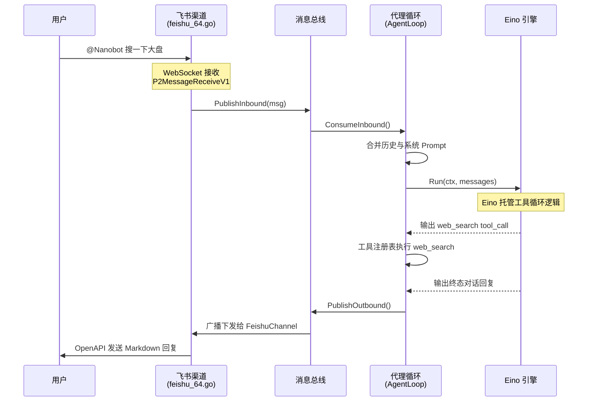

# 🚀 开源轻量级 OpenClaw Golang 解决方案，任何设备都可部署！

在 AI Agent 爆火的今天，你是否苦恼于复杂庞大的框架，或者无法在资源受限的设备（如极客板、手机、甚至路由器）上顺畅跑起你的专属 AI 助手？

今天为大家带来一款**轻量级、跨平台、极简设计的 Golang AI Agent 解决方案** —— 它吸取了 OpenClaw 与 Nanobot Python 版的精华，摒弃了臃肿的依赖，采用纯 Go 语言打造。无论是本地电脑，还是边缘设备，**编译后只有一个二进制文件，即插即用，任何设备都可部署！** 💻📱🤖

---

## 🏗️ 一、极简而强大的架构总览

这款 Golang 版的 Nanobot 采用了经典的 **分层 + 事件驱动** 架构设计。它的核心思想是：**AI Agent 的本质是“消息路由 + 工具编排 + 状态管理”**，因此只需用最精简的 Go 代码（~7.4K 行），就能复刻原版 430K 庞大代码量的 99% 核心能力！

💡 **四大核心分层：**
1. **入口驱动层**：基于 Cobra 搭建，支持 `gateway`（常驻多渠道网关服务）与 `agent`（单次或交互式 CLI 对话模式）。
2. **异步消息总线**：作为项目的神经大动脉。使用 Go Channel 实现，采用 **Outbound 广播模式**。Agent 生成的消息可无缝分发给多个渠道和命令行。
3. **内核编排引擎**：没有手搓裸调大模型 API，而是**深度拥抱了字节跳动开源的 CloudWeGo Eino ADK**。由 Eino 来托管流式的工具循环（Tool Calling）、结果追查，极大地精简了逻辑代码！
4. **外部设施对接**：包含 17+ LLM 供应商路由切换、双层长期记忆 (`MEMORY.md` + `HISTORY.md`) 以及可以无限动态拔插的 MCP (Model Context Protocol) 外部服务。

---

## 🔄 二、完整流转揭秘：以飞书渠道 (Feishu) 为例

当你在飞书上 @ 机器人说：*“帮我查一下今天的大盘走势”* 时，底层到底发生了什么？

1️⃣ **接入层（WebSocket 监听）**：`channels/feishu_64.go` 使用长连接实时接收飞书 SDK 返回的 `P2MessageReceiveV1` 消息事件，过滤鉴权后提取文本。
2️⃣ **解耦层（汇入总线）**：飞书 Channel 将用户请求转换为统一的 `InboundMessage` 并通过 `msgBus.PublishInbound(msg)` 推入消息通道。业务逻辑彻底与渠道解绑。
3️⃣ **编排层（AgentLoop 与 Eino）**：核心循环从 Channel 拿到消息，并用 `ContextBuilder` 追加包括双层记忆、技能在内的超长 Prompt。最爽的是，将所有信息组装后直接塞给 `runner.Run(ctx, messages)`，由 **Eino 自动托管 Tool Calls 的迭代调用和分析**，代码行数大大缩减！
4️⃣ **响应下发（广播总线）**：Agent 生成终态结果，封装为 `OutboundMessage`。Go channel `fanOut` 会将其**广播给所有注册的渠道监听者**（比如命令行及飞书终端），飞书收到属于自己的 `OutboundMessage` 后反向调用 OpenAPI 卡片推回用户。

🎯 **这就是整个闭环，行云流水，没有任何多余的性能损耗！**

---

## 🧠 三、核心黑科技深入：技能与记忆系统

相比于传统的一问一答機器人，这款解决方案之所以能被称为 "Agent"，离不开它惊艳的**技能 (Skills) 与双层记忆 (Memory) 系统**。

### 🧩 1. 动态拔插的技能系统 (SkillsLoader)
想让 Agent 学会新招式？你不需要改写 Go 源代码！
在 `agent/skills.go` 中，Agent 使用了一套类似 Markdown Frontmatter 的声明式系统：
- 只需要在工作区的 `skills/` 目录下创建一个 `SKILL.md`，使用 YAML 头部定义 `name`, `description` 和 `requires_bins`（依赖的环境/工具）。
- Agent 启动时，会自动扫描内外挂载的技能目录，甚至是解析出系统的缺失依赖。
- LLM 请求前，系统会自动汇总所有可用技能（`<skills>...</skills>` 格式）并注入 Prompt，使得 Agent 明白它能“做什么”。

### 📚 2. 双机制长短期记忆引擎 (MemoryStore)
很多开源 Agent 聊久了就会“失忆”或者 Context 爆满崩溃，但我们设计了一层巧妙的记忆整合策略 (`agent/memory.go`)：
- **`HISTORY.md` (短期事件日志)**：以时间线 `[YYYY-MM-DD HH:MM]` 记录对话摘要，可供按时间段回溯。
- **`MEMORY.md` (长期事实库)**：记录用户的习惯、事实、偏好。

**真正的神来之笔：LLM Tool Calling 驱动自我进化**
这甚至不是纯代码层面的定期归档。当内存条目达到阈值后（`unconsolidated >= memoryWindow`），后台 Golang 协程会悄悄启动。
程序内部虚拟调用了一次含有 `save_memory` 工具能力的大模型。强迫 LLM 对近期对话进行复盘总结：
“把没用的废话丢弃，把关于用户喜好的事实提炼浓缩全量写至 `MEMORY.md`。同时生成一行时间戳摘要记录进 `HISTORY.md`。” 此举彻底避免了死记硬背导致的上下文爆炸（Context Window Boom）问题。

### 🔌 3. 外挂级能力延伸 (MCP 原生支持)
你以为这就结束了？对于一个现代化 Agent，怎么少得了接入**外部数据大世界**的能力。
Golang 版本的实现原生支持了 **Model Context Protocol (MCP)**：
借助 `NewStdioMCPClient` 启动子进程，或 `NewStreamableHttpClient` 建立长连，系统会自动将 `sqlite` 或第三方云服务能力代理成本地工具（`MCPToolWrapper`），向大模型无缝输送强大的额外战斗力。

---

## 🌟 总结：为何你该立刻尝试？

1. **部署无难度**：编译生成的单文件只有几十 MB，丢在随身树莓派、闲置安卓手机 (Termux) 或者云服务器中，`./nanobot gateway` 就能当私有管家。
2. **生态好扩展**：无缝对接飞书、Telegram、Discord；更内置了定时任务系统 (CronTool) 可以定期给你推送新闻。
3. **架构极内聚**：Golang 并发天生适合这类多渠道路由分发的场景，资源占用极小，不再为 Python 环境依赖导致的各种报错发愁！

💡 **你的全能开源专属助理已经就位，快克隆代码一键起飞吧！** 🚀

*(如果您在源码结构中看到了有趣的设计，欢迎在评论区一起讨论交流！)*
