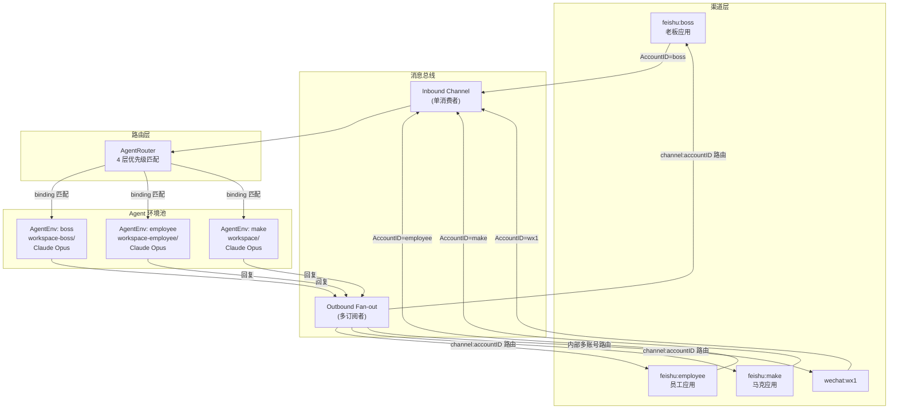
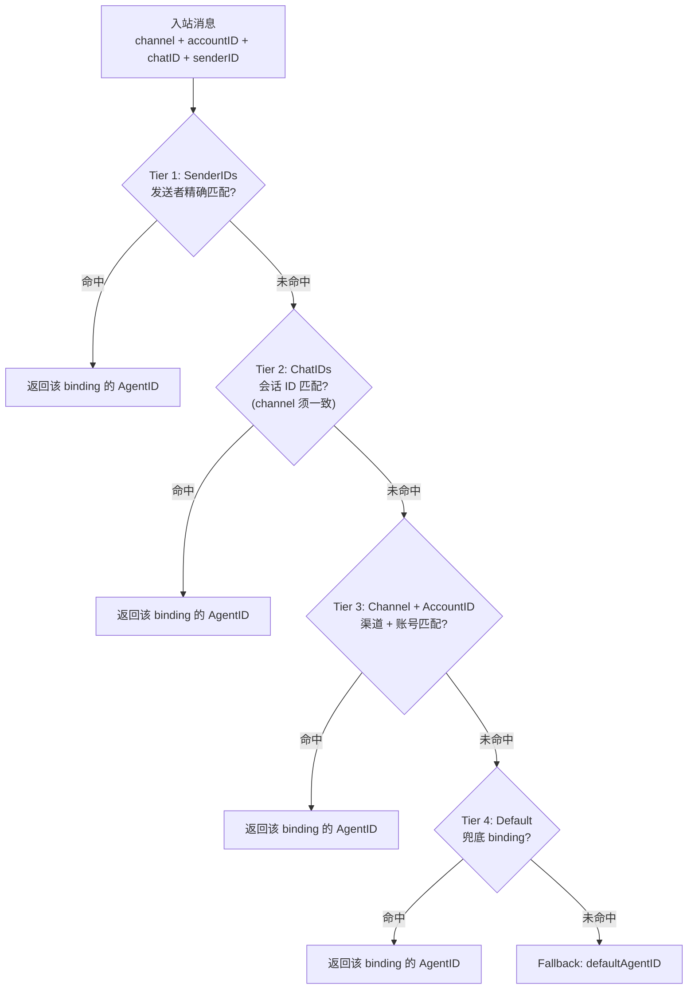
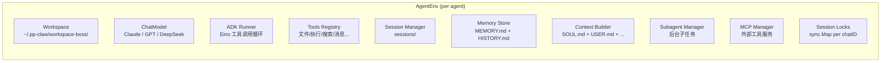
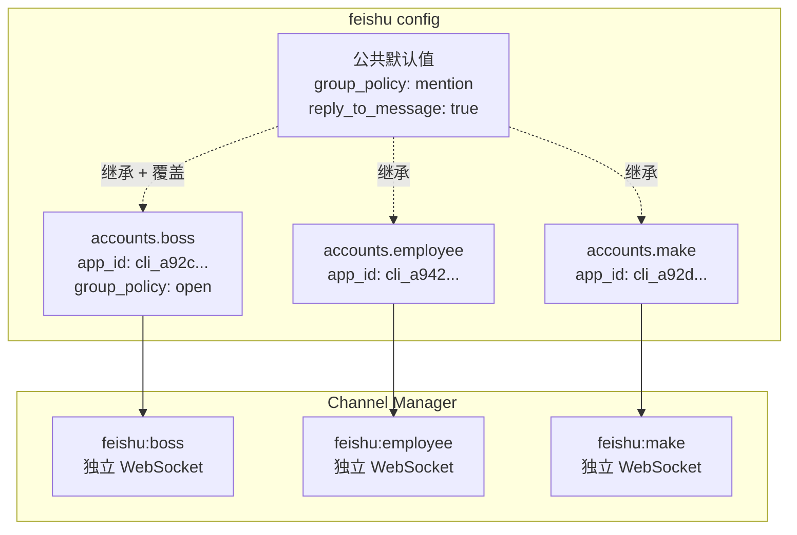
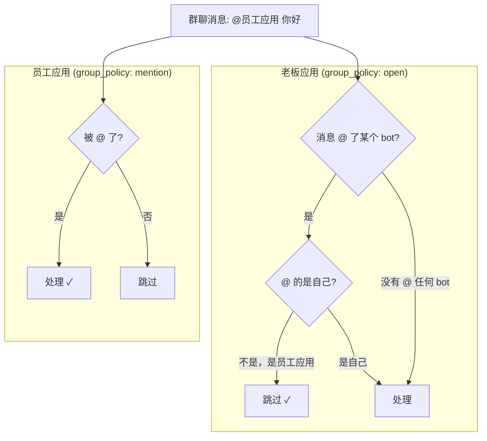
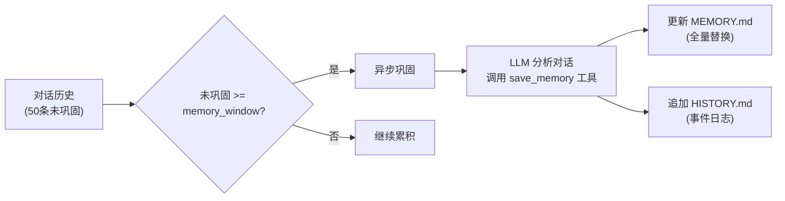
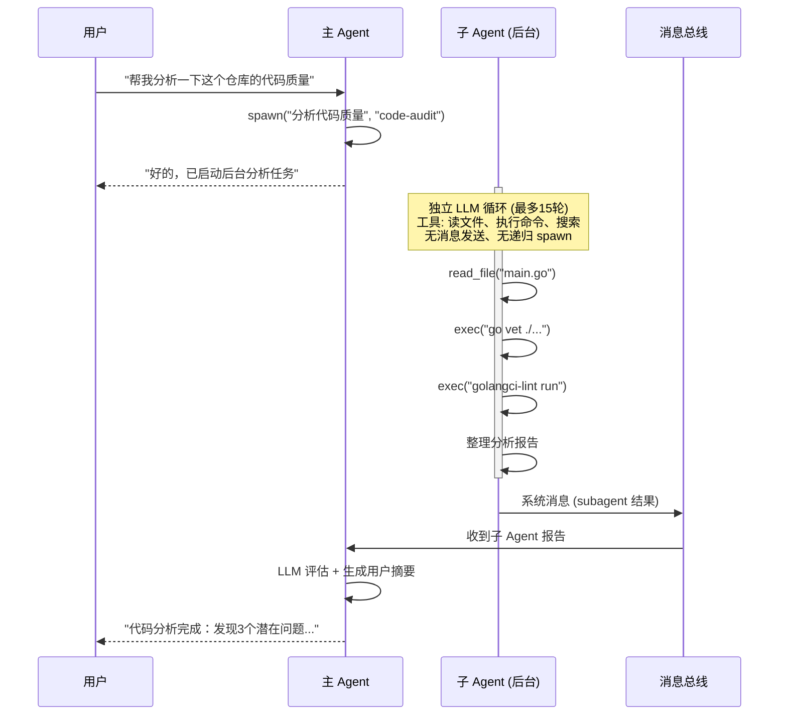

# 皮皮虾支持多 Agent 了，可以创建你的军团了

> 一个飞书应用对应一个 Agent，一个 Agent 有独立的大脑、记忆和工具箱。你可以让老板的助手帮他盯群消息，让员工的助手只在被 @ 时回复，让翻译助手专注特定群聊——它们共享同一个进程，却彼此互不干扰。

## 起因：一个进程跑多个 "人格"

最初做皮皮虾（PP-Claw）的时候，架构很简单——一个 Agent 服务所有渠道。飞书来了消息，微信来了消息，全都塞给同一个大脑处理。模型、记忆、工具，全局共享。

这在单人使用时没问题。但当我把它丢给团队用的时候，问题就来了：

- 老板希望机器人在群里"有问必答"，不用 @ 也能回
- 普通员工希望机器人安静点，@了才说话
- 我自己想要一个带完整工具链的私人助手，有自己的记忆空间

如果只有一个 Agent，那 `group_policy` 只能设一个值。要么全 open，要么全 mention。想要不同的行为？对不起，做不到。

小龙虾（OpenClaw）用 43 万行 TypeScript 实现了完整的多 Agent 协作——Controller + Plugin Runtime + WS RPC，架构很强，但太重了。我需要的是一个轻量方案：**声明式配置、运行时隔离、零代码添加新 Agent**。

于是就有了皮皮虾的多 Agent 架构。

## 整体架构

先看全貌。皮皮虾的多 Agent 不是"多个进程"，而是**一个进程内的多个隔离环境**。每个 Agent 有自己的 workspace、模型、记忆、会话历史，但共享同一个消息总线和渠道连接。



## 核心设计：四层路由

消息进来后第一件事不是处理，是决定**谁来处理**。

皮皮虾用了一个 4 层优先级的路由器，配置在 YAML 的 `bindings` 里，从上往下匹配，第一个命中的胜出：



对应的配置长这样：

```yaml
agents:
    bindings:
        # Tier 1: 特定用户 → 代码审查 Agent
        - agent_id: code-review
          sender_ids: ["user_dev_001"]

        # Tier 2: 特定群聊 → 翻译 Agent
        - agent_id: translator
          channel: feishu
          chat_ids: ["oc_translation_group"]

        # Tier 3: 飞书老板账号 → 老板 Agent
        - agent_id: boss
          channel: feishu
          account_id: boss

        # Tier 3: 飞书员工账号 → 员工 Agent
        - agent_id: employee
          channel: feishu
          account_id: employee

        # Tier 4: 兜底
        - agent_id: make
          default: true
```

为什么要 4 层？因为实际场景中，你可能需要"**张三不管在哪个群发消息，都交给专属 Agent 处理**"（Tier 1），也可能需要"**翻译群的所有消息都交给翻译 Agent**"（Tier 2），还可能需要"**老板应用的所有消息走老板 Agent**"（Tier 3）。这些需求可以共存，优先级自然不同。

路由器的代码实现很朴素——对同一个 bindings 数组扫 4 遍，每遍只看对应层级的条件。bindings 数量通常个位数，O(4n) 无所谓。

## AgentEnv：每个 Agent 一个独立世界

路由决定了"谁来处理"，但处理需要资源。皮皮虾用 `AgentEnv` 封装了一个 Agent 运行所需的全部状态：



关键点：**每个 Agent 的 Session 和 Memory 完全隔离**。

同一个用户给老板应用发"你好"和给员工应用发"你好"，产生的 SessionKey 分别是 `boss:feishu:boss:chatID` 和 `employee:feishu:employee:chatID`——对话历史互不污染，记忆各自独立。

这些 AgentEnv 实例由 `AgentEnvPool` 管理，采用**双重检查锁**的懒创建模式：

```go
func (p *AgentEnvPool) GetOrCreate(agentID string) (*AgentEnv, error) {
    // 快速路径：读锁查缓存
    p.mu.RLock()
    env, ok := p.envs[agentID]
    p.mu.RUnlock()
    if ok {
        return env, nil
    }

    // 慢路径：写锁 + 二次检查 + 创建
    p.mu.Lock()
    defer p.mu.Unlock()
    if env, ok = p.envs[agentID]; ok {
        return env, nil
    }

    env, err := p.createEnv(agentID)
    // ...
}
```

第一条消息到达时才创建对应的 Agent 环境，之后复用。配置里声明了 10 个 Agent 但只有 3 个收到过消息？那就只有 3 个 AgentEnv 实例。

## 消息处理：并发但有序

多 Agent 场景下最容易踩的坑是并发问题。两条消息几乎同时到达同一个群聊，你不能让它们并行处理——否则会话历史会乱序，模型看到的上下文不一致。

皮皮虾的方案是 **goroutine 级并发 + session 级串行**：

```mermaid
sequenceDiagram
    participant Bus as 消息总线
    participant Loop as AgentLoop
    participant Router as AgentRouter
    participant Pool as AgentEnvPool
    participant Env as AgentEnv
    participant LLM as 大模型

    Bus->>Loop: msg1 (boss, chatA)
    Bus->>Loop: msg2 (employee, chatB)
    Bus->>Loop: msg3 (boss, chatA)

    par 并发分发
        Loop->>Router: Resolve(msg1) → boss
        Loop->>Router: Resolve(msg2) → employee
        Loop->>Router: Resolve(msg3) → boss
    end

    par msg1 和 msg2 并行执行
        Loop->>Pool: GetOrCreate("boss")
        Pool-->>Env: AgentEnv[boss]
        Note over Env: AcquireSession("boss:feishu:boss:chatA")<br/>获取锁 ✓
        Env->>LLM: 处理 msg1
        LLM-->>Env: 回复 msg1

        Loop->>Pool: GetOrCreate("employee")
        Pool-->>Env: AgentEnv[employee]
        Note over Env: AcquireSession("employee:feishu:employee:chatB")<br/>获取锁 ✓
        Env->>LLM: 处理 msg2
        LLM-->>Env: 回复 msg2
    end

    Note over Loop: msg3 等待 msg1 完成
    Loop->>Pool: GetOrCreate("boss")
    Note over Env: AcquireSession("boss:feishu:boss:chatA")<br/>等待 msg1 释放锁...
    Env->>LLM: 处理 msg3
    LLM-->>Env: 回复 msg3
```

msg1（boss, chatA）和 msg2（employee, chatB）属于不同 session，完全并行。msg3（boss, chatA）和 msg1 属于同一 session，必须等 msg1 处理完才能开始。

实现上就是一个 `sync.Map` 存储 `sessionKey → *sync.Mutex`：

```go
func (env *AgentEnv) AcquireSession(sessionKey string) *sync.Mutex {
    val, _ := env.sessionLocks.LoadOrStore(sessionKey, &sync.Mutex{})
    return val.(*sync.Mutex)
}
```

简单到没什么好说的，但很重要。

## 多账号渠道：一个飞书跑三个应用

多 Agent 只解决了"谁来处理"的问题，还有"消息从哪来"的问题。

以飞书为例，如果你有三个飞书应用（老板、员工、马克），每个应用有不同的 `app_id` 和 `app_secret`，传统做法是跑三个进程。皮皮虾的做法是 **一个进程、三个 Channel 实例**：



配置用的是"顶层默认 + 账号覆盖"的模式，灵感来自小龙虾的 `AccountConfig & { accounts?: Record<string, AccountConfig> }` 模式：

```yaml
feishu:
    enabled: true
    # 顶层 = 公共默认值
    group_policy: "mention"
    reply_to_message: true
    wiki_enabled: true

    default_account: boss
    accounts:
        boss:
            app_id: "cli_a92c..."
            app_secret: "xxx"
            group_policy: "open"    # 覆盖：老板群聊全放行
        employee:
            app_id: "cli_a942..."
            app_secret: "xxx"
            # 继承 mention 模式
        make:
            app_id: "cli_a92d..."
            app_secret: "xxx"
```

底层用了 Go 的 `yaml:",inline"` 嵌入 + 反射 `mergeNonZero` 做字段级合并。没有 `accounts` 时退化为单账号模式，完全向后兼容。

## 多 Bot 群聊的 mention 难题

多账号带来了一个意料之外的问题。

当老板应用设为 `group_policy: "open"`（群聊全放行），员工应用设为 `"mention"`（@了才回）时，如果有人在群里 `@员工应用 你好`——**老板应用也会回复**。因为 "open" 模式下它不检查 @，看到群里任何消息都处理。

修复方案：启动时自动调用飞书 `/bot/v3/info` 获取自己的 `open_id`，在 "open" 模式下如果消息明确 @ 了某个 bot 且不是自己，就跳过。



## 记忆系统：每个 Agent 有自己的大脑

皮皮虾的记忆是双层结构：

- **MEMORY.md**：长期记忆，每次巩固时全量替换。存储用户画像、偏好、关键事实
- **HISTORY.md**：追加式事件日志，可 grep 搜索

记忆巩固由 LLM 驱动——当未巩固消息数超过 `memory_window` 阈值时，异步触发：



关键：**每个 Agent 的 MemoryStore 绑定到自己的 workspace**。老板 Agent 的记忆在 `workspace-boss/memory/`，员工 Agent 的在 `workspace-employee/memory/`。同一个用户分别和两个 Agent 聊天，产生的记忆是独立的。

如果 LLM 巩固连续失败 3 次，会降级为原文归档——不丢数据，只是不那么"聪明"。

## 子 Agent：后台军团

除了通过路由分配的命名 Agent，皮皮虾还支持**运行时动态生成的子 Agent**。

主 Agent 可以通过 `spawn` 工具启动后台任务。子 Agent 有自己的 LLM 循环（最多 15 轮），但工具集是受限的——能读写文件、执行命令、搜索网页，但**不能发消息给用户，也不能再 spawn 子 Agent**（防止递归炸弹）。



子 Agent 完成后不是直接把结果甩给用户，而是先发到消息总线的 "system" 通道，主 Agent 收到后再跑一遍模型来生成用户友好的摘要。这样用户看到的永远是经过主 Agent "翻译"的结果，而不是原始的工具输出。

## 与小龙虾的对比

说实话，皮皮虾的多 Agent 和小龙虾的多 Agent，解决的是**同一类问题**，但走了**完全不同的路**。

### 设计理念

小龙虾是一个"平台"思维。43 万行 TypeScript，Controller 统一调度，Plugin Runtime 沙箱隔离，Agent 之间通过 WS RPC 通信。它的目标是让你能在上面搭建任意复杂的多 Agent 工作流，Agent 之间可以互相调用、协商、分工。

皮皮虾是一个"工具"思维。8000 多行 Go，没有 Controller，没有 RPC，没有沙箱。它的目标是让你用 30 行 YAML 就能把"一个进程服务多种角色"这件事搞定。Agent 之间的关系不是"协作"，而是"各管各的"。

### 具体差异

| 维度 | 小龙虾 (OpenClaw) | 皮皮虾 (PP-Claw) |
|------|-------------------|------------------|
| **代码量** | 43w+ 行 TypeScript | 8000+ 行 Go |
| **Agent 选择** | Controller 动态调度 | 静态 binding 声明式路由 |
| **Agent 间通信** | WS RPC，Agent 可互相调用 | 无直接通信（仅 spawn 子任务） |
| **资源隔离** | Plugin Runtime 沙箱 | Workspace 目录级隔离 |
| **工具分配** | 每个 Agent 可配置不同工具集 | 所有 Agent 共享同一工具集 |
| **运行时开销** | Node.js，内存较高 | 单二进制，~15MB 内存 |
| **部署复杂度** | npm + 依赖链 | 一个二进制文件 |
| **多账号** | accounts map + defaultAccount | 同样的 accounts + default_account |
| **配置方式** | YAML / 环境变量 | YAML（完全对齐） |
| **并发模型** | 单线程事件循环 | goroutine 真并发 |

### 皮皮虾的优势

1. **极简部署**。单个 Go 二进制，15MB 内存，0.3 秒启动。树莓派都能跑。
2. **声明式路由**。加一个 Agent 就是加几行 YAML，不用写一行代码。
3. **真并发**。不同 session 的消息 goroutine 级并行，不存在事件循环阻塞的问题。
4. **配置兼容**。多账号配置模式和小龙虾完全对齐，迁移零成本。

### 皮皮虾的不足

1. **Agent 间不能协作**。老板 Agent 没法"请教"翻译 Agent。小龙虾可以。
2. **工具集不能按 Agent 定制**。所有 Agent 拿到的工具一模一样。如果你希望翻译 Agent 不能执行 shell 命令，目前做不到。
3. **路由是静态的**。不能根据消息内容动态决定交给哪个 Agent（比如"这条消息像是在问代码问题，转给 code-review Agent"）。小龙虾的 Controller 可以做到。
4. **没有工作流编排**。多个 Agent 串行或并行执行一个复杂任务，皮皮虾还不支持。

### 怎么选？

如果你的需求是"**多个角色各自独立服务不同的人群**"——用皮皮虾。30 行配置搞定，维护成本约等于零。

如果你的需求是"**多个 Agent 协作完成复杂任务**"——用小龙虾。Controller + RPC 的架构天然支持这种场景。

大部分场景下，前者就够了。

## 实战：从零配置一个三 Agent 军团

假设你有三个飞书应用，想让它们各自对接不同的 Agent：

### 第一步：声明 Agent

```yaml
agents:
    defaults:
        workspace: ~/.pp-claw/workspace
        model: pa/claude-opus-4-6
        max_tokens: 8192
        temperature: 0.1
        max_tool_iterations: 80
        memory_window: 50

    list:
        - id: make
          name: "马克个人助手"
          default: true
          max_tool_iterations: 80

        - id: employee
          name: "员工助手"
          workspace: ~/.pp-claw/workspace-employee
          max_tool_iterations: 40

        - id: boss
          name: "老板助手"
          workspace: ~/.pp-claw/workspace-boss
          max_tool_iterations: 40
```

每个 Agent 可以覆盖 `defaults` 中的任意字段。不指定的就继承默认值。

### 第二步：配置路由

```yaml
    bindings:
        - agent_id: make
          channel: feishu
          account_id: make

        - agent_id: employee
          channel: feishu
          account_id: employee

        - agent_id: boss
          channel: feishu
          account_id: boss

        - agent_id: make
          default: true
```

`account_id` 对应的是下面 `accounts` map 里的 key。

### 第三步：配置飞书多账号

```yaml
channels:
    feishu:
        enabled: true
        # 公共默认值
        group_policy: "mention"
        react_emoji: "THUMBSUP"
        reply_to_message: true
        wiki_enabled: true

        default_account: boss
        accounts:
            make:
                app_id: "cli_a92d..."
                app_secret: "xxx"
            employee:
                app_id: "cli_a942..."
                app_secret: "xxx"
            boss:
                app_id: "cli_a92c..."
                app_secret: "xxx"
                group_policy: "open"  # 老板应用群聊全放行
```

### 第四步：启动

```bash
./pp-claw gateway
```

一条命令。三个飞书应用各自建立 WebSocket 连接，三个 Agent 环境按需创建，消息自动路由。

启动日志里你会看到：

```
AgentEnv 创建完成  agent_id=boss   workspace=~/.pp-claw/workspace-boss    tools=14
AgentEnv 创建完成  agent_id=employee  workspace=~/.pp-claw/workspace-employee  tools=14
AgentEnv 创建完成  agent_id=make   workspace=~/.pp-claw/workspace   tools=14
```

三个独立的世界，一个进程搞定。

## 端到端消息流（以老板应用群聊消息为例）

把完整链路串一遍：

```mermaid
sequenceDiagram
    participant FS as 飞书服务器
    participant CH as FeishuChannel<br/>(feishu:boss)
    participant BUS as MessageBus
    participant LOOP as AgentLoop
    participant RTR as AgentRouter
    participant POOL as AgentEnvPool
    participant ENV as AgentEnv[boss]
    participant LLM as Claude Opus
    participant MGR as Channel Manager

    FS->>CH: WebSocket 推送消息
    Note over CH: group_policy=open<br/>检查: 没有 @其它bot → 通过
    CH->>CH: HandleMessage()<br/>AccountID = "boss"
    CH->>BUS: PublishInbound<br/>SessionKey = "feishu:boss:chatID"

    BUS->>LOOP: ConsumeInbound

    LOOP->>RTR: Resolve("feishu", "boss", chatID, senderID)
    RTR-->>LOOP: agentID = "boss"

    LOOP->>POOL: GetOrCreate("boss")
    POOL-->>LOOP: AgentEnv[boss]

    LOOP->>ENV: AcquireSession("boss:feishu:boss:chatID")
    Note over ENV: 获取 session 锁

    ENV->>ENV: 加载会话历史 + 构建 system prompt
    ENV->>LLM: [system, ...history, user_msg]
    LLM-->>ENV: "好的，已收到..."

    ENV->>ENV: saveTurn() 保存到 workspace-boss/sessions/
    ENV->>BUS: PublishOutbound<br/>Channel="feishu", AccountID="boss"

    BUS->>MGR: dispatchOutbound
    MGR->>MGR: resolveOutboundKey("feishu", "boss")<br/>→ "feishu:boss"
    MGR->>CH: Send(msg)
    CH->>FS: 飞书 API 回复消息
```

## 写在最后

皮皮虾的多 Agent 不是什么革命性的设计。它就是把一个简单的需求——**一个进程服务多种角色**——用最朴素的方式实现了。

没有复杂的调度算法，没有花哨的通信协议。一个路由表、一个环境池、一组 mutex，就这么多。

但有时候，工程的价值就在于此。不是做出了什么惊天动地的东西，而是把一个常见的痛点，用尽可能少的代码、尽可能低的运行成本、尽可能简单的配置解决掉。

如果你也有类似的需求——一个飞书应用给老板、一个给团队、一个给自己——不妨试试。30 行 YAML，创建你的 Agent 军团。

---

*PP-Claw 项目地址：[github.com/yangkun19921001/PP-Claw](https://github.com/yangkun19921001/PP-Claw)*
