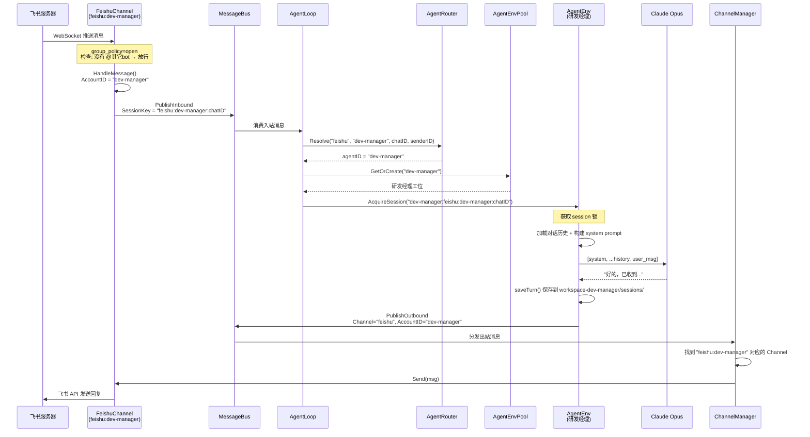

# 别让一个 Agent 干所有事：聊聊我们的多 Agent 架构设计

> 
>
> 皮皮虾的多 Agent 就是这套分工的设计版，一个进程是项目组，每个 Agent 是其中一个角色，有自己独立的记忆、工具链和行为策略，但共享同一个消息总线和网络连接。

## 单 Agent 到底有什么问题？

先说说为什么要折腾多 Agent。

皮皮虾最早就一个 Agent。飞书消息来了、微信消息来了，全塞给同一个"大脑"处理。模型、记忆、工具、行为策略，全局共享，只有一份。

这就好比整个研发团队只有一个人，什么都干, 前端后端测试运维全是他。活少的时候还行，一忙起来就崩了，而且没法按角色定制行为。

具体遇到了这些痛点：

**1. 行为策略没法按场景拆分**

研发经理希望机器人在群里"有问必答"，群里任何消息都回复（`group_policy: open`），好随时掌握项目动态、回答产品经理的问题。但前端开发觉得太吵了，希望 @ 了才回（`group_policy: mention`），专心写 TUI 布局的时候别打扰。一个 Agent 只能设一个策略，要么全 open 要么全 mention，没法两头兼顾。

这就像研发经理说"产品经理的消息都要立刻响应"，但前端说"别找我，排期了再说"。一个人没法同时执行两套规则。

**2. 记忆和上下文互相污染**

研发经理问机器人"上次说的那个需求进展如何？"，结果机器人把它跟前端开发聊的飞书卡片适配的事搞混了，因为所有人的对话历史和记忆都存在同一个地方。

类比一下：前端和后端共用一个笔记本记东西，前端写的"TUI 布局要改"和后端写的"消息路由逻辑要改"混在一起，翻的时候根本分不清谁说的哪件事。

**3. 模型和工具没法差异化配置**

研发经理需要高精度的大模型来统筹需求、审查代码，前端开发日常问答用小模型就够了。后端 Agent 需要 shell 执行权限来跑测试和部署脚本，前端 Agent 只需要搜索文档和回复消息。一个 Agent，一套配置，改不了。

就像让前端开发和后端开发共用一台电脑、一套开发环境，前端要 Chrome DevTools 和 Figma，后端要 VSCode 和终端，装在一起谁也用不好。

**4. 没法水平扩展角色**

想加一个"文档助手"专门服务产品经理查 PRD？想加一个"值班机器人"只在周末响应线上告警？单 Agent 架构下，每加一个角色就意味着在同一个大脑里塞更多互相冲突的逻辑。

这不是加人的问题，这是一个人要分裂成好几个人格的问题。

## 多 Agent 解决了什么？


多 Agent 不是什么高深的技术概念，就是**让对的人干对的事**。

回到研发团队的类比：

| 单 Agent（一人包办）       | 多 Agent（专业分工）                                         |
| -------------------------- | ------------------------------------------------------------ |
| 一套行为策略，所有场景共用 | 研发经理 open 模式随时响应产品经理，前端 mention 模式专心写 TUI |
| 一份记忆，所有对话混在一起 | 每人一个工位一个笔记本，互不干扰                             |
| 一套工具，所有角色共享     | 后端有终端和 shell 执行权限，前端只有搜索和回复              |
| 加角色就是加复杂度         | 加角色就是加一个工位，配好桌椅就行                           |

具体到皮皮虾，多 Agent 意味着：

- **行为隔离**：研发经理 Agent 群聊全放行，前端 Agent @ 才回，互不干扰
- **记忆隔离**：每个 Agent 有独立的对话历史和长期记忆，不会串台
- **配置隔离**：每个 Agent 可以用不同的模型、不同的工具迭代次数、不同的 workspace
- **运行时隔离**：但它们跑在同一个进程里，共享网络连接和消息总线，资源开销很小

而且，加一个新 Agent 只需要在 YAML 里加几行配置，不用写一行代码。就像团队招了个新人，给他配个工位、分配好职责就完事了。

## 整体架构

先看全貌。皮皮虾的多 Agent 不是"多个进程"，而是**一个进程内的多个隔离环境**。每个 Agent 有自己的 workspace、模型配置、记忆和会话历史，但共享同一个消息总线和渠道连接。


消息进来后先入队到消息总线，路由层根据 channel、accountID、chatID、senderID 决定分给哪个 Agent 处理。处理完了，回复再通过消息总线出站分发回对应的渠道。

## 核心设计：四层路由, 需求分配给谁？

消息进来后第一件事不是处理，是决定**谁来处理**。

这跟实际项目组里分需求一模一样。就拿 PP-Claw 自己的研发团队举例。产品经理负责收集用户反馈、写 PRD，研发经理统筹进度，前端开发写 TUI 界面和飞书卡片交互，后端开发搞 Agent 框架和消息路由。飞书上有几个群：「产品需求群」聊需求和排期，「线上 Bug 群」处理用户反馈的问题，「前端评审群」过页面交互和样式。每天消息满天飞，问题是：这条消息该谁来处理？

皮皮虾的路由器就干这件事，4 层优先级，从上往下匹配，第一个命中的胜出：


拿 PP-Claw 的研发团队走一遍，你就明白每一层在干什么了：

**第 1 层：按人路由, 产品经理说话，研发经理必须亲自接**

产品经理偶尔会在不同的群里扔一句"多 Agent 路由这个功能下周能上吗？"或者"飞书消息丢失率最近怎么样？"。不管是在「线上 Bug 群」发的还是「前端评审群」发的，这种来自需求方的消息不能让普通开发去回，必须研发经理亲自处理，因为他掌握全局进度，知道该怎么答。

所以第 1 层的规则是：只要消息发送者是产品经理，不管在哪个群，统一路由到研发经理 Agent。

**第 2 层：按群路由, 线上 Bug 群的问题，后端来接**

有用户在「线上 Bug 群」反馈"消息路由到错误的 Agent 了"，这个群聊的都是后端逻辑的事，不管是产品运营还是测试提的，都应该交给后端 Agent 处理。

同样，「前端评审群」里的消息不管谁发的，都归前端 Agent 处理，聊的是 TUI 布局、飞书卡片样式这些事。一个群对应一个职责域。

**第 3 层：按应用入口路由, 从哪个飞书应用进来的，就归谁**

团队给研发经理、前端、后端各建了一个飞书机器人应用。从"前端机器人"进来的消息归前端 Agent，从"后端机器人"进来的归后端 Agent。这是最常见的路由方式，一个飞书应用对应一个 Agent。

**第 4 层：兜底, 都匹配不上？研发经理兜着**

总有些消息不属于任何明确分类，比如新来的实习生在某个没配路由的群里问了个问题，或者其他部门的人跑过来问"你们这个消息总线谁负责的？"。这种归属不清楚的事，现实中就是研发经理来接，先搞清楚什么情况，再分配给具体的人。

所以兜底 Agent 设为研发经理，别让消息石沉大海。

对应的 YAML 配置：

```yaml
agents:
    bindings:
        # 第1层: 产品经理不管在哪个群发消息，研发经理亲自接
        - agent_id: dev-manager
          sender_ids: ["user_pm_001"]

        # 第2层: 线上Bug群 → 后端；前端评审群 → 前端
        - agent_id: backend
          channel: feishu
          chat_ids: ["oc_bug_report_group"]

        - agent_id: frontend
          channel: feishu
          chat_ids: ["oc_frontend_review_group"]

        # 第3层: 按飞书应用入口分
        - agent_id: dev-manager
          channel: feishu
          account_id: dev-manager

        - agent_id: frontend
          channel: feishu
          account_id: frontend

        # 第4层: 归属不明的消息，研发经理兜底
        - agent_id: dev-manager
          default: true
```

为什么要 4 层？因为实际项目里这些需求是同时存在的：

- 产品经理的消息比群归属更重要，他是需求源头，必须优先按人匹配
- 「线上 Bug 群」里产品、运营、测试都有人，但问题本质是后端的，按群匹配比按人匹配合理
- 大部分日常消息按飞书应用入口分就够了
- 总要有个兜底，归属不清的事本来就是研发经理的活

这四层从具体到笼统，层层兜住。跟你在团队里分配需求的逻辑一样：先看是不是产品经理交代的，再看是不是特定职责域的群，再看是从哪个应用入口进来的，最后兜底。

路由器的代码实现很朴素，对 bindings 数组扫 4 遍，每遍只看对应层级的条件。bindings 数量通常就几条，O(4n) 无所谓。

## AgentEnv：每个人的独立工位

路由决定了"谁来处理"，但处理需要一整套装备。每个 Agent 的工位上都有什么？


关键点：**每个 Agent 的项目档案和笔记本完全隔离**。

同一个用户给"研发经理应用"发"你好"和给"前端应用"发"你好"，产生的 SessionKey 分别是 `dev-manager:feishu:dev-manager:chatID` 和 `frontend:feishu:frontend:chatID`。就像你跟研发经理聊的内容不会出现在运维的笔记本里一样。

这些工位由 `AgentEnvPool`（工位管理处）统一管理，采用**懒创建**：配置了 10 个 Agent 但只有 3 个实际收到过消息？那就只建 3 个工位。第一条消息到达时才搭工位，之后复用。

```go
func (p *AgentEnvPool) GetOrCreate(agentID string) (*AgentEnv, error) {
    // 快速路径：读锁查缓存，工位已经在了，直接返回
    p.mu.RLock()
    env, ok := p.envs[agentID]
    p.mu.RUnlock()
    if ok {
        return env, nil
    }

    // 慢路径：写锁 + 二次检查 + 搭建新工位
    p.mu.Lock()
    defer p.mu.Unlock()
    if env, ok = p.envs[agentID]; ok {
        return env, nil
    }

    env, err := p.createEnv(agentID)
    // ...
}
```

## 消息处理：并发但有序

多 Agent 最容易踩的坑是并发问题。

举个场景：后端开发同时收到两个群的消息。「线上 Bug 群」产品经理问"消息路由那个 Bug 修了吗？"，「技术架构群」前端同事问"新的 Agent 状态接口联调了吗？"。这两条消息可以并行处理，因为它们是不同的对话上下文。

但如果「线上 Bug 群」连续来了两条消息呢？第一条"路由 Bug 修了吗？"还没回完，产品经理第二条"顺便看看这个 PR"就到了。这时候必须排队，否则两条消息同时操作同一个对话历史，上下文就乱了。

皮皮虾的方案是 **goroutine 级并发 + session 级串行**：


这就像后端开发可以同时处理「线上 Bug 群」和「技术架构群」的事情（不同上下文各干各的），但同一个群内部的对话必须一条一条来，不然回复顺序就乱了。

实现上就是一个 `sync.Map` 存储 `sessionKey → *sync.Mutex`，简单到没什么好说的，但很关键。

## 多账号渠道：一个飞书跑多个应用

多 Agent 解决了"谁来处理"，还有"消息从哪来"。

以飞书为例，PP-Claw 团队有三个飞书应用（研发经理用的、前端用的、后端用的），每个应用有不同的 `app_id`。传统做法是跑三个进程。皮皮虾的做法是**一个进程、三个 Channel 实例**，就像同一间办公室开三个门：


配置用的是"顶层默认 + 账号覆盖"的模式。大部分配置在顶层写一遍，个别账号需要特殊处理的再覆盖：

```yaml
feishu:
    enabled: true
    # 顶层 = 团队统一规范
    group_policy: "mention"
    reply_to_message: true
    wiki_enabled: true

    default_account: dev-manager
    accounts:
        dev-manager:
            app_id: "cli_a92c..."
            app_secret: "xxx"
            group_policy: "open"    # 研发经理群聊全放行
        frontend:
            app_id: "cli_a942..."
            app_secret: "xxx"
            # 继承 mention 模式，前端专心写码，别打扰
        backend:
            app_id: "cli_a92d..."
            app_secret: "xxx"
```

没有 `accounts` 时自动退化为单账号模式，完全向后兼容。不改配置文件，老版本照样跑。

## 多 Bot 群聊的 mention 问题

多账号带来了一个开发时没想到的问题。

场景：研发经理应用设为 `group_policy: open`（群聊全放行），前端应用设为 `mention`（@ 才回）。产品经理在群里发了一条 `@前端应用 这个 TUI 布局看一下`，结果**研发经理应用也回复了**。

为什么？因为 open 模式不检查 @，群里任何消息都处理。但这条消息明明是产品经理发给前端的，研发经理插什么嘴？

这就像产品经理在需求评审会上说"前端你看一下这个交互"，结果研发经理也抢答了，因为他的规则是"所有讨论我都参与"。

修复方案：启动时自动获取自己的身份 ID，在 open 模式下加一个判断。如果消息明确 @ 了某个 bot 且不是自己，就闭嘴。


## 记忆系统：每个人有自己的笔记本

每个 Agent 的记忆是独立的，分两层：

- **MEMORY.md**（长期记忆）：类似个人笔记本里的"重要事项"页，记录用户画像、偏好、关键结论。每次巩固时全量更新。
- **HISTORY.md**（事件日志）：类似工作日志，只追加不修改，记录发生了什么事。

记忆巩固由 LLM 驱动，当未整理的对话超过阈值时，异步触发整理：


关键：**每个 Agent 的记忆存在自己的 workspace 下**。研发经理 Agent 的记忆在 `workspace-dev-manager/memory/`，前端 Agent 的在 `workspace-frontend/memory/`。就像每个人的笔记本锁在自己抽屉里，别人看不到也改不了。

如果 LLM 整理连续失败 3 次，会降级为原文归档，宁可笨一点，也不丢数据。

## 子 Agent：给正式员工配实习生

除了通过路由分配的"正式员工"Agent，皮皮虾还支持**运行时动态生成的子 Agent**，可以理解为给正式员工临时分配实习生。

主 Agent 觉得某个任务比较重（比如产品经理让后端开发跑一遍 PP-Claw 仓库的代码质量检查），可以 spawn 一个子 Agent 在后台跑。子 Agent 有自己的 LLM 循环（最多 15 轮），但权限是受限的，能读写文件、执行命令、搜索网页，但**不能直接回复用户，也不能再派实习生**（防止无限套娃）。


子 Agent 干完活不是直接把结果甩给用户，而是先交给主 Agent 过目。主 Agent 再用自己的判断力把原始结果翻译成用户能看懂的摘要。用户看到的永远是经过"正式员工审核"的内容，而不是实习生的原始输出。

## 实战：从零配置一个研发团队


假设你有三个飞书应用，想让它们分别对接"研发经理"、"前端开发"、"后端开发"三个角色：

### 第一步：定义团队成员

```yaml
agents:
    defaults:
        workspace: ~/.pp-claw/workspace
        model: pa/claude-opus-4-6
        max_tokens: 8192
        temperature: 0.1
        max_tool_iterations: 80
        memory_window: 50

    list:
        - id: dev-manager
          name: "研发经理助手"
          default: true
          workspace: ~/.pp-claw/workspace-dev-manager
          max_tool_iterations: 80    # 经理要统筹全局，工具链给足额度

        - id: frontend
          name: "前端开发助手"
          workspace: ~/.pp-claw/workspace-frontend
          max_tool_iterations: 40

        - id: backend
          name: "后端开发助手"
          workspace: ~/.pp-claw/workspace-backend
          max_tool_iterations: 40
```

每个成员可以覆盖 `defaults` 里的配置，不写的就用默认值。

### 第二步：分配工作职责（路由）

```yaml
    bindings:
        - agent_id: backend
          channel: feishu
          account_id: backend

        - agent_id: frontend
          channel: feishu
          account_id: frontend

        - agent_id: dev-manager
          channel: feishu
          account_id: dev-manager

        - agent_id: dev-manager
          default: true    # 没人认领的消息，研发经理兜底
```

### 第三步：配置各自的飞书应用

```yaml
channels:
    feishu:
        enabled: true
        group_policy: "mention"
        react_emoji: "THUMBSUP"
        reply_to_message: true
        wiki_enabled: true

        default_account: dev-manager
        accounts:
            backend:
                app_id: "cli_a92d..."
                app_secret: "xxx"
            frontend:
                app_id: "cli_a942..."
                app_secret: "xxx"
            dev-manager:
                app_id: "cli_a92c..."
                app_secret: "xxx"
                group_policy: "open"  # 研发经理群聊全放行
```

### 第四步：开工

```bash
./pp-claw gateway
```

一条命令。三个飞书应用各自建立 WebSocket 连接，三个 Agent 环境按需创建，消息自动路由。日志里你会看到：

```
AgentEnv 创建完成  agent_id=dev-manager  workspace=~/.pp-claw/workspace-dev-manager  tools=14
AgentEnv 创建完成  agent_id=frontend     workspace=~/.pp-claw/workspace-frontend      tools=14
AgentEnv 创建完成  agent_id=backend      workspace=~/.pp-claw/workspace               tools=14
```

三个工位搭好了，各就各位。

## 端到端消息流

把一条消息从进门到出门的完整链路走一遍，以研发经理群聊收到消息为例：



## 写在最后

回头看，皮皮虾的多 Agent 架构没什么高深的东西。

就是把"一个人干所有事"变成了"每个人干自己的事"。一个路由表决定谁来干，一个环境池给每人配好装备，一组锁保证同一件事不会两个人同时抢。

没有复杂的调度算法，没有 Agent 之间的协作协议。这些以后可以加，但目前大部分场景不需要。你的研发团队里，前端和后端各写各的代码，不需要实时共享脑子，只要别踩到对方的代码就行了。

如果你也有类似的需求，一个飞书应用给研发经理对接产品经理、一个给前端团队专注交互开发、一个给后端同学处理线上问题，每个角色有自己的行为策略和记忆空间，30 行 YAML 就能搞定。

---

*PP-Claw 项目地址：[github.com/yangkun19921001/PP-Claw](https://github.com/yangkun19921001/PP-Claw)*