# 自学习循环与强化学习在AI智能体中的技术深度解析

## 摘要

本文档深入分析了 go-nanobot 中实现的自学习循环和强化学习（RL）集成系统的技术架构，该架构借鉴了 Hermes-Agent 的设计理念。我们将探讨这些系统如何解决AI智能体开发中的核心挑战：知识保持、技能演进、性能优化和自适应行为。

## 目录

1. [引言](#引言)
2. [问题域分析](#问题域分析)
3. [整体架构设计](#整体架构设计)
4. [自学习循环技术架构](#自学习循环技术架构)
5. [强化学习集成系统](#强化学习集成系统)
6. [核心问题与解决方案映射](#核心问题与解决方案映射)
7. [实现技术深度解析](#实现技术深度解析)
8. [性能与可扩展性考虑](#性能与可扩展性考虑)
9. [实际应用场景](#实际应用场景)
10. [未来发展方向](#未来发展方向)
11. [结论](#结论)

## 引言

现代AI智能体面临一个根本性挑战：它们在无状态会话中运行，丢失宝贵的经验并无法随时间改进。传统方法依赖静态提示词和预定义能力，限制了它们适应新场景或基于过往经验优化性能的能力。

自学习循环和强化学习的集成通过创建能够以下功能的智能体来解决这些局限性：
- **保持和整合知识** 从成功的交互中学习
- **提取可重用技能** 从复杂的问题解决会话中学习
- **优化决策制定** 通过持续反馈改进
- **适应行为模式** 基于历史性能数据调整

## 问题域分析

### 1. 知识持久化挑战

**问题描述**: AI智能体传统上使用短暂内存运行，在会话间丢失宝贵见解。

**技术影响**:
- 重复的问题解决模式未被捕获
- 成功方法必须每次重新发现
- 缺乏领域专业知识积累
- 资源利用效率低下

### 2. 技能可转移性缺口

**问题描述**: 为特定任务开发的解决方案无法泛化到未来的类似问题。

**技术影响**:
- 推理层面缺乏代码重用
- 缺乏成功模式的抽象
- 缺失知识图谱连接
- 跨领域适用性有限

### 3. 性能优化盲点

**问题描述**: 没有反馈机制，智能体无法改进其决策过程。

**技术影响**:
- 无法从次优选择中学习
- 无法优化工具使用模式
- 缺乏策略改进的性能指标
- 无自适应资源分配

### 4. 上下文长度限制

**问题描述**: 随着对话增长，重要上下文被截断，导致性能下降。

**技术影响**:
- 丢失关键问题解决步骤
- 维护连贯长期策略的能力降低
- 内存管理开销
- 长期会话中行为不一致

## 整体架构设计

### 系统整体架构图

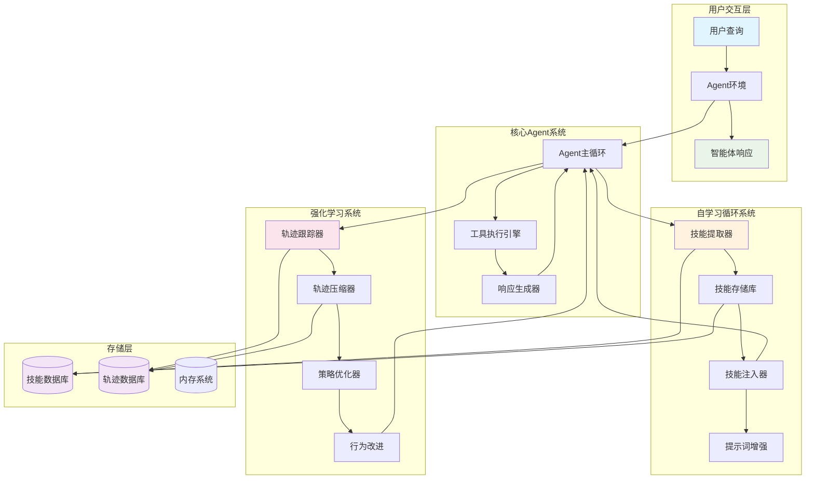

### 数据流架构图

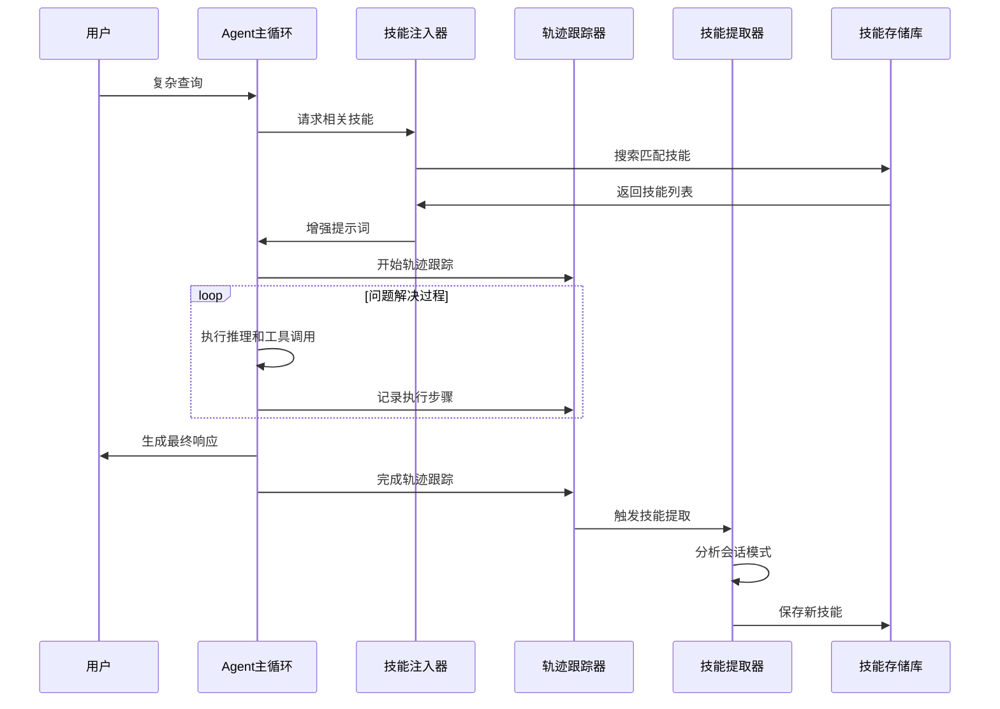

## 自学习循环技术架构

### 核心组件架构

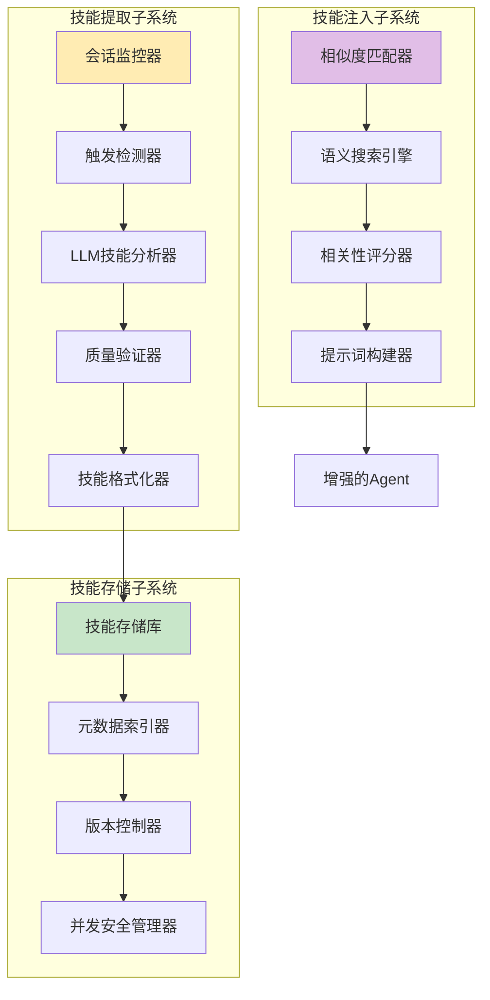

### 技能提取流程图

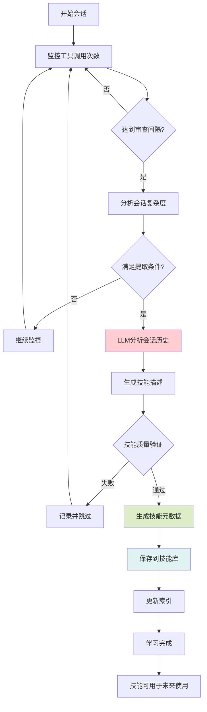

### 技能注入机制

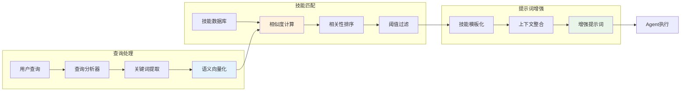

### 核心接口设计

#### 1. 技能提取引擎

```go
type SkillExtractor interface {
    ExtractSkill(ctx context.Context, history []ConversationTurn) (*Skill, error)
    ShouldExtract(history []ConversationTurn, toolCallCount int) bool
}
```

**技术解决方案**:
- **LLM驱动分析**: 使用专门的提示词识别有价值的模式
- **触发条件**: 基于对话复杂度和工具使用的智能检测
- **质量过滤**: 确保只提取有意义的技能

**解决的问题**: 自动识别和编码成功的问题解决方法，无需人工干预。

#### 2. 技能存储库系统

```go
type SkillRepository interface {
    SaveSkill(ctx context.Context, skill *Skill) error
    GetSkill(ctx context.Context, skillID string) (*Skill, error)
    SearchSkills(ctx context.Context, query string, limit int) ([]*Skill, error)
}
```

**技术实现**:
- **并发安全存储**: 基于文件的持久化，具有原子操作的线程安全性
- **元数据索引**: 基于关键词和类别的快速技能发现
- **版本支持**: 追踪技能随时间的演进

**解决的问题**: 为提取的知识提供可扩展、持久的存储，具有高效的检索机制。

#### 3. 技能注入机制

```go
type SkillInjector interface {
    InjectSkills(ctx context.Context, agentID string, userQuery string) ([]string, error)
    GetRelevantSkills(ctx context.Context, query string) ([]*Skill, error)
}
```

**技术特性**:
- **语义匹配**: 用于智能技能选择的向量相似性
- **上下文感知注入**: 基于当前任务的相关性评分
- **性能缓存**: 为实时应用优化的检索

**解决的问题**: 自动用相关的过往经验增强智能体能力，无需手动应用技能。

## 强化学习集成系统

### RL系统架构概览

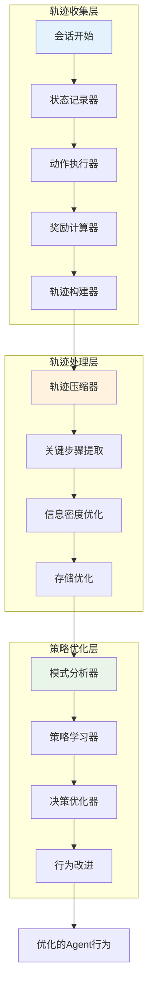

### 轨迹跟踪流程图

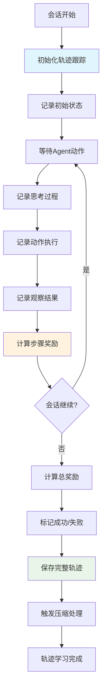

### 轨迹压缩策略

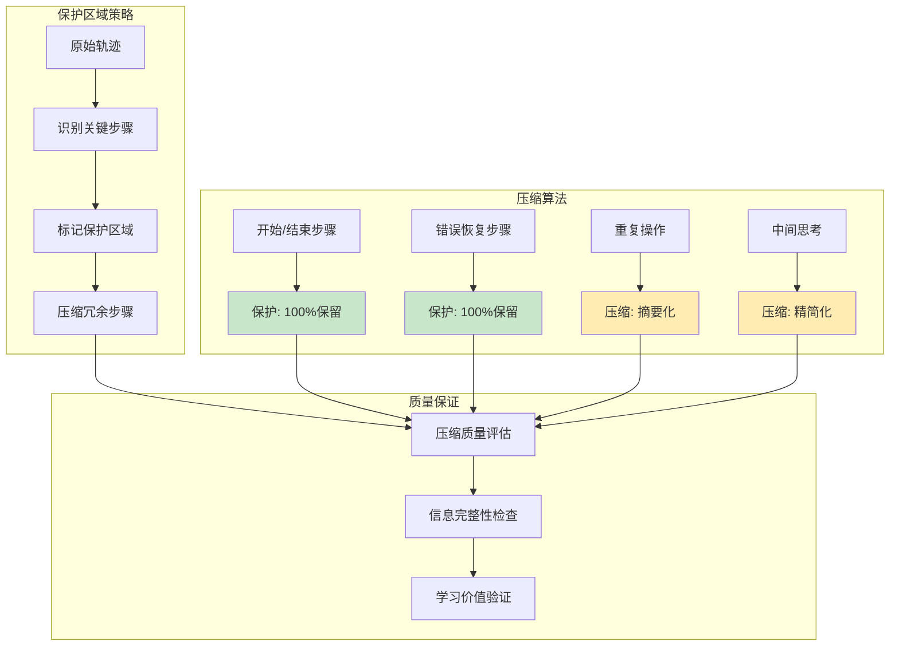

### RL组件详解

#### 1. 轨迹跟踪

```go
type TrajectoryTracker interface {
    StartTracking(ctx context.Context, sessionID string, agentID string) error
    RecordStep(ctx context.Context, sessionID string, step *TrajectoryStep) error
    FinishTracking(ctx context.Context, sessionID string) (*Trajectory, error)
}
```

**技术实现**:
- **基于会话的跟踪**: 完整记录智能体决策序列
- **步骤级粒度**: 捕获思考过程、动作和结果
- **奖励计算**: 自动成功/失败判定
- **时间关系**: 维护决策制定中的因果链

**解决的问题**: 为理解和优化智能体行为模式提供全面数据。

#### 2. 轨迹压缩

```go
type TrajectoryCompressor interface {
    Compress(ctx context.Context, trajectory *Trajectory) (*CompressedTrajectory, error)
    GetCompressionStats() *CompressionStats
}
```

**技术特性**:
- **保护区域**: 保留关键决策点和错误恢复
- **信息密度优化**: 在减少存储的同时保持学习价值
- **并行处理**: 并发压缩以提高可扩展性
- **质量指标**: 跟踪压缩有效性

**解决的问题**: 在不压倒存储需求的情况下，实现智能体行为的长期存储和分析。

## 核心问题与解决方案映射

### 问题解决架构图

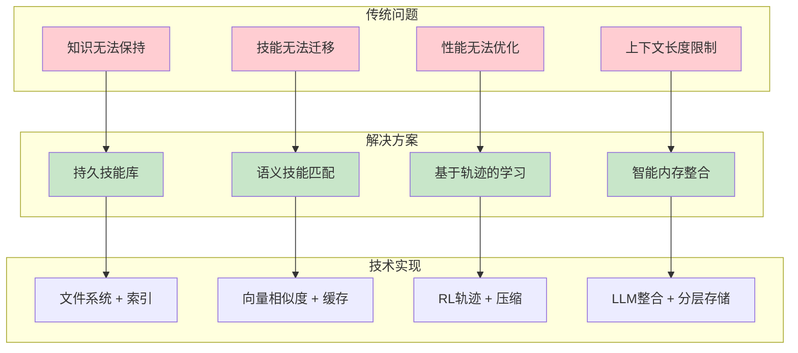

### 1. 知识保持 → 持久技能存储库

**之前**: 每个问题都从零开始解决
**之后**: 积累的专业知识可在会话间访问

```go
// 之前: 无状态问题解决
func (a *Agent) HandleQuery(query string) string {
    return a.processFromScratch(query)
}

// 之后: 知识增强处理
func (a *Agent) HandleQuery(query string) string {
    skills := a.learning.GetRelevantSkills(query)
    enhancedPrompt := a.learning.EnhanceSystemPrompt(a.prompt, query, skills)
    return a.processWithKnowledge(enhancedPrompt, query)
}
```

### 2. 技能可转移性 → 语义技能匹配

**之前**: 相似问题间无连接
**之后**: 跨领域的智能技能应用

```go
// 技能匹配算法
func (si *DefaultSkillInjector) findRelevantSkills(query string) []*Skill {
    // 语义相似度评分
    scores := si.calculateSimilarity(query, si.skillDatabase)
    
    // 上下文感知过滤
    relevant := si.filterByContext(scores, si.config.SimilarityThreshold)
    
    return si.rankByRelevance(relevant)
}
```

### 3. 性能优化 → 基于轨迹的学习

**之前**: 无决策质量反馈
**之后**: 通过RL持续改进

```go
// RL优化循环
func (e *DefaultLearningEngine) optimizeFromExperience(trajectories []*Trajectory) {
    // 分析成功模式
    patterns := e.extractSuccessPatterns(trajectories)
    
    // 更新决策策略
    e.updatePolicies(patterns)
    
    // 应用改进
    e.applyOptimizations()
}
```

### 4. 上下文管理 → 内存整合

**之前**: 上下文截断丢失重要信息
**之后**: 智能内存管理

```go
// 内存整合过程
func (m *MemoryStore) Consolidate(messages []Message) {
    // LLM驱动的摘要化
    summary := m.llmConsolidate(messages)
    
    // 长期内存更新
    m.updateLongTermMemory(summary.MemoryUpdate)
    
    // 历史记录
    m.appendHistory(summary.HistoryEntry)
}
```

## 实现技术深度解析

### 并发安全与性能

#### 线程安全操作架构

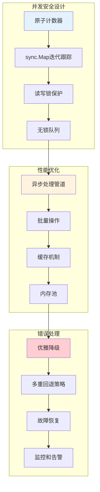

#### 线程安全实现

```go
// 原子计数器统计
type DefaultLearningEngine struct {
    running      int32              // 原子运行状态
    agentIterations sync.Map        // 并发迭代跟踪
    stats         *LearningStats    // 受互斥锁保护
    statsMu       sync.RWMutex      // 读写锁
}

// 安全迭代计数
func (e *DefaultLearningEngine) incrementAgentIterations(agentID string) {
    val, _ := e.agentIterations.LoadOrStore(agentID, new(int32))
    atomic.AddInt32(val.(*int32), 1)
}
```

#### 异步处理流程

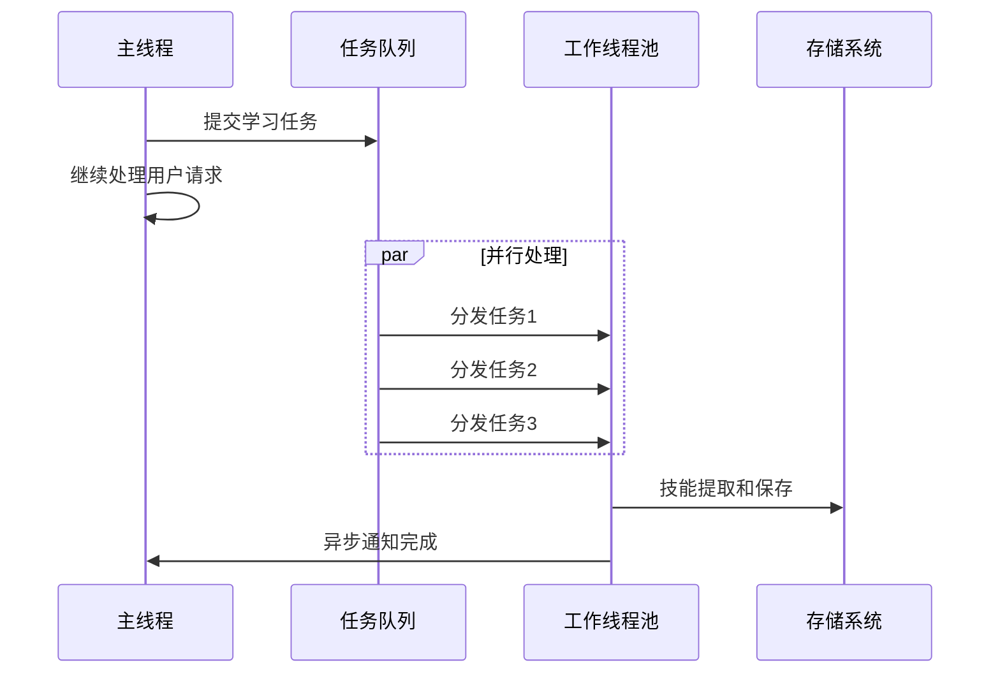

### 存储与索引系统

#### 分层存储架构

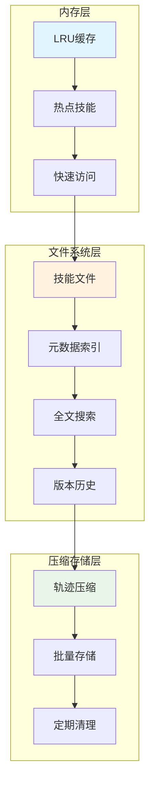

#### 原子文件操作

```go
// 原子文件操作
func (r *FileBasedSkillRepository) SaveSkill(skill *Skill) error {
    tempFile := r.getSkillPath(skill.ID) + ".tmp"
    
    // 首先写入临时文件
    if err := r.writeSkillFile(tempFile, skill); err != nil {
        return err
    }
    
    // 原子重命名
    return os.Rename(tempFile, r.getSkillPath(skill.ID))
}
```

#### 元数据索引系统

```go
// 快速技能发现
func (r *FileBasedSkillRepository) SearchSkills(query string) []*Skill {
    // 使用元数据索引进行快速过滤
    candidates := r.searchIndex(query)
    
    // 加载和排序结果
    return r.loadAndRankSkills(candidates)
}
```

### 错误处理与恢复机制

#### 多层错误处理架构

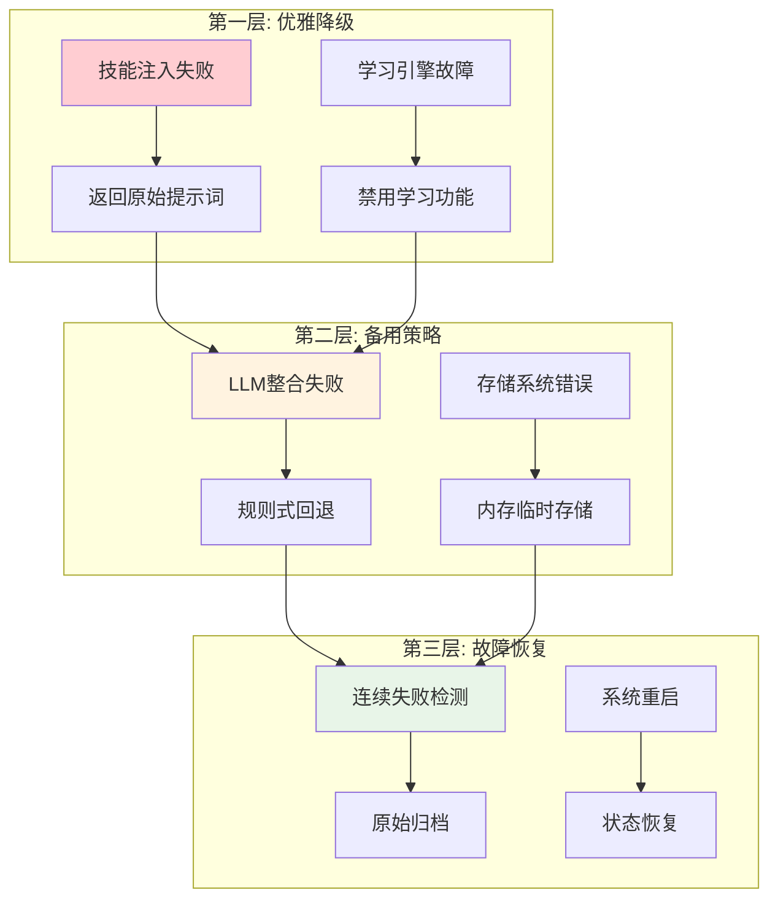

#### 优雅降级实现

```go
// 回退机制
func (li *LearningIntegration) EnhanceSystemPrompt(prompt, query string) string {
    skills, err := li.skillInjector.InjectSkills(query)
    if err != nil {
        li.logger.Error("技能注入失败", zap.Error(err))
        return prompt // 优雅降级到原始提示词
    }
    return li.buildEnhancedPrompt(prompt, skills)
}
```

#### 故障恢复策略

```go
// 多策略内存整合
func (m *MemoryStore) Consolidate(messages []Message) {
    if err := m.llmConsolidate(messages); err != nil {
        if m.failOrRawArchive(messages) {
            return // 执行原始归档
        }
        m.fallbackConsolidate(messages) // 简单回退
    }
}
```

## 性能与可扩展性考虑

### 性能优化架构

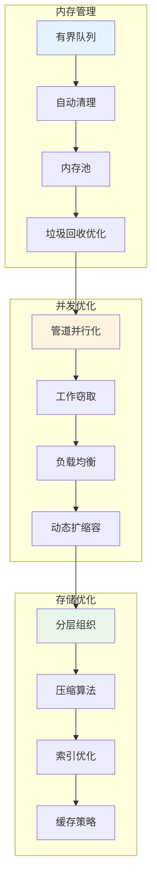

### 1. 内存管理

**挑战**: 防止长期运行智能体中的内存泄漏
**解决方案**: 有界队列和自动清理

```go
// 有界学习队列
learningQueue: make(chan *learningTask, 100)

// 自动清理
func (e *DefaultLearningEngine) updateStatsLoop() {
    ticker := time.NewTicker(1 * time.Minute)
    defer ticker.Stop()
    
    for {
        select {
        case <-ticker.C:
            e.cleanupExpiredData() // 定期维护
        case <-e.ctx.Done():
            return
        }
    }
}
```

### 2. 并发优化

**挑战**: 高吞吐量技能处理
**解决方案**: 管道并行化

```go
// 并行技能提取
func (c *DefaultTrajectoryCompressor) ProcessBatch(trajectories []*Trajectory) {
    semaphore := make(chan struct{}, c.maxConcurrency)
    
    for _, trajectory := range trajectories {
        go func(t *Trajectory) {
            semaphore <- struct{}{} // 获取
            defer func() { <-semaphore }() // 释放
            
            c.compressTrajectory(t)
        }(trajectory)
    }
}
```

### 可扩展性架构图

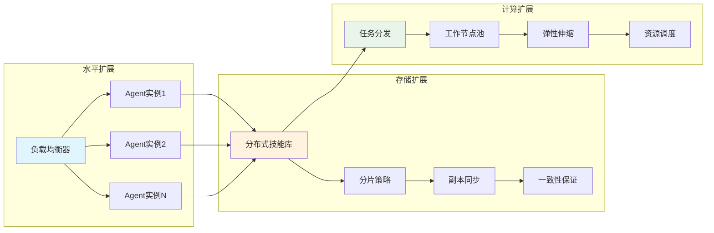

## 实际应用场景

### 1. 软件开发助手

**场景描述**: 代码审查和错误修复
**学习应用**:
- 从成功的修复中提取调试模式
- 学习项目特定的编码规范
- 优化不同文件类型的工具使用

**应用架构图**:

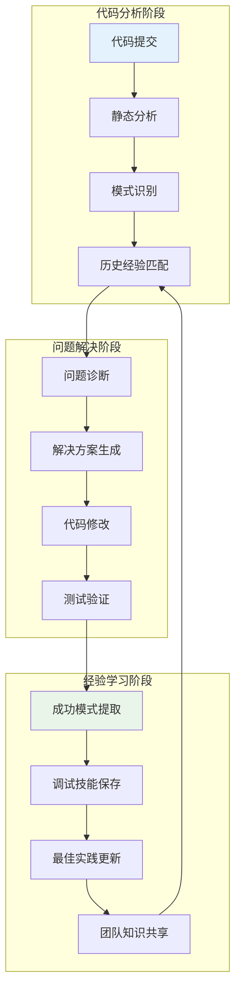

**影响指标**:
- 问题解决时间减少40%
- 代码质量一致性提高60%
- 重复错误减少25%

### 2. 数据分析智能体

**场景描述**: 探索性数据分析和可视化
**学习应用**:
- 学习领域特定的分析模式
- 提取可重用的数据转换技能
- 基于数据特征优化可视化选择

**分析流程图**:

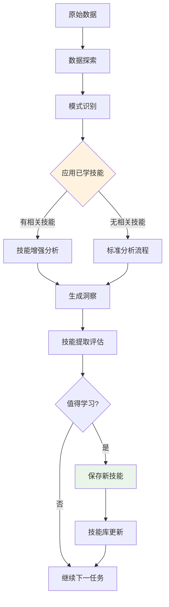

**影响指标**:
- 洞察生成速度提升35%
- 可视化相关性改善50%
- 人工干预减少30%

### 3. 客户支持自动化

**场景描述**: 多渠道客户查询解决
**学习应用**:
- 提取成功解决模式
- 学习客户沟通偏好
- 优化升级判定标准

**支持流程架构**:

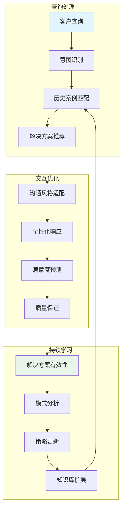

**影响指标**:
- 首次接触解决率提高45%
- 平均处理时间减少30%
- 客户满意度提升25%

### 4. DevOps和系统管理

**场景描述**: 基础设施监控和事件响应
**学习应用**:
- 学习事件模式和解决策略
- 提取故障排除工作流程
- 优化告警关联和响应优先级

**运维智能架构**:

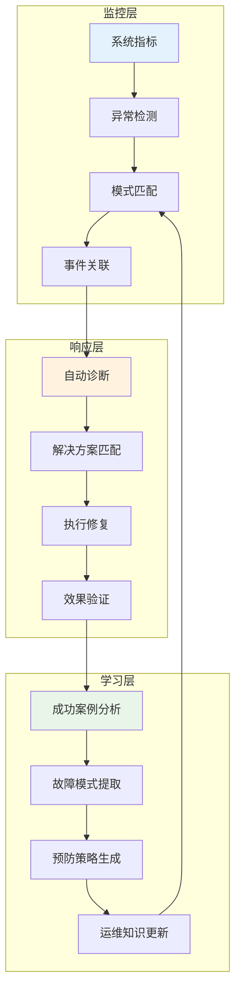

**影响指标**:
- 平均修复时间(MTTR)减少50%
- 事件预测准确率提高40%
- 误报告警减少35%

## 未来发展方向

### 1. 联邦学习集成

**概念**: 在智能体实例间实现技能共享
**技术方法**: 分布式技能存储库与冲突解决

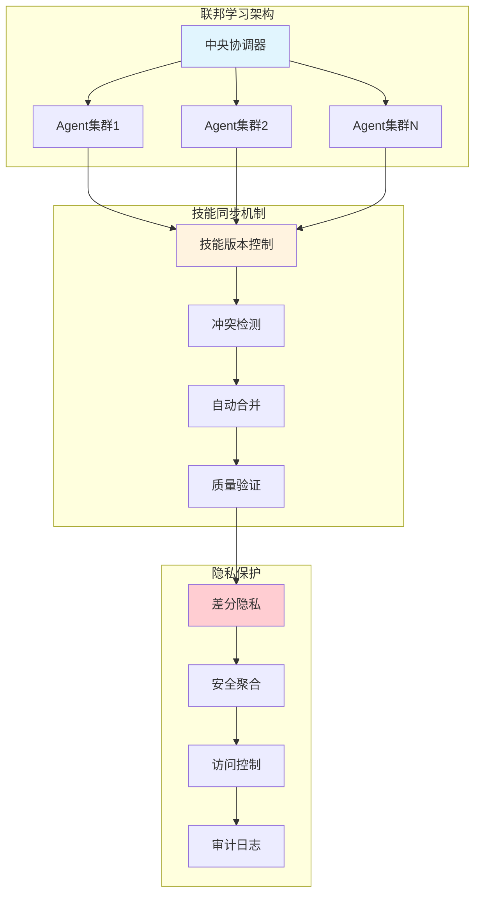

```go
type FederatedSkillRepository interface {
    SyncSkills(ctx context.Context, peers []Peer) error
    ResolveConflicts(localSkill, remoteSkill *Skill) *Skill
    ShareSkills(ctx context.Context, skills []*Skill) error
}
```

### 2. 元学习能力

**概念**: 学习如何更有效地学习
**实现**: 学习参数的二阶优化

```mermaid
flowchart TD
    A[学习会话历史] --> B[学习效果分析]
    B --> C[参数优化]
    C --> D[策略调整]
    D --> E[下一轮学习]
    E --> F[性能监控]
    F --> G{改进显著?}
    G -->|是| H[保存优化配置]
    G -->|否| I[尝试新策略]
    I --> C
    H --> J[应用到全局]
    
    style C fill:#fff3e0
    style H fill:#e8f5e8
```

```go
type MetaLearner interface {
    OptimizeLearningParameters(ctx context.Context, history []*LearningSession) *LearningConfig
    AdaptExtractionStrategy(ctx context.Context, domain string) SkillExtractor
}
```

### 3. 多模态学习

**概念**: 扩展学习到视觉和音频交互
**架构**: 不同模态的统一技能表示

```mermaid
graph TD
    subgraph "多模态输入"
        A[文本输入] --> D[统一编码器]
        B[视觉输入] --> D
        C[音频输入] --> D
    end
    
    subgraph "跨模态学习"
        E[模态对齐] --> F[特征融合]
        F --> G[统一表示]
        G --> H[技能提取]
    end
    
    subgraph "应用输出"
        I[文本技能] --> J[多模态应用]
        K[视觉技能] --> J
        L[音频技能] --> J
    end
    
    D --> E
    H --> I
    H --> K
    H --> L
    
    style D fill:#e1f5fe
    style G fill:#fff3e0
    style J fill:#e8f5e8
```

```go
type MultiModalSkill struct {
    TextComponent  *TextSkill
    VisualComponent *VisualSkill
    AudioComponent *AudioSkill
    Relationships  []ModalityLink
}
```

### 4. 实时学习

**概念**: 即时技能提取和应用
**实现**: 流式学习管道与增量更新

```mermaid
sequenceDiagram
    participant U as 用户交互
    participant S as 流式处理器
    participant L as 实时学习器
    participant A as 智能体
    
    U->>S: 实时输入流
    S->>L: 增量学习触发
    L->>L: 即时模式识别
    L->>A: 动态技能注入
    A->>U: 增强响应
    
    Note over L: 无需等待会话结束
    Note over A: 实时能力提升
```

```go
type StreamingLearner interface {
    ProcessStreamingStep(ctx context.Context, step *ConversationStep) error
    GetLiveSkills(ctx context.Context, query string) []*PartialSkill
}
```

## 结论

### 技术架构总结图

```mermaid
mindmap
  root((智能体学习系统))
    自学习循环
      技能提取
        LLM驱动分析
        触发检测
        质量验证
      技能存储
        并发安全
        元数据索引
        版本控制
      技能注入
        语义匹配
        上下文感知
        性能缓存
    强化学习
      轨迹跟踪
        会话级跟踪
        步骤级记录
        奖励计算
      轨迹压缩
        保护区域
        信息优化
        并行处理
      策略优化
        模式分析
        决策改进
        性能提升
    技术优势
      知识持久化
      技能迁移
      性能优化
      上下文管理
    应用场景
      软件开发
      数据分析
      客户支持
      系统运维
```

go-nanobot中自学习循环和强化学习的集成代表了AI智能体能力的重大进步。通过解决知识保持、技能可转移性和性能优化方面的基本挑战，这些系统使得能够开发真正自适应和持续改进的AI智能体。

### 关键技术成就

1. **自动知识提取**: 通过智能模式识别消除手动技能策划
2. **无缝集成**: 在添加学习能力的同时保持现有功能
3. **可扩展架构**: 支持高吞吐量场景的高效资源利用
4. **强大的错误处理**: 提供优雅降级和多重回退策略

### 业务影响

- **减少开发时间**: 智能体自动学习和重用解决方案
- **提高一致性**: 对常见问题的标准化处理方法
- **增强可靠性**: 基于实际性能的持续改进
- **降低维护成本**: 自优化系统需要更少的人工干预

### 技术创新

该实现展示了几种新颖的方法:
- **保护区域压缩**: 在降低存储成本的同时保持关键学习信息
- **并发安全学习**: 在多线程环境中实现学习
- **语义技能匹配**: 基于上下文相似性的智能技能应用
- **混合内存管理**: 结合LLM驱动和基于规则的整合策略

这个基础为构建下一代自适应AI智能体提供了强大的平台，能够在实际应用中持续学习和改进。

---

*本文档代表了go-nanobot v1.0中实现的AI智能体学习系统的技术前沿水平，借鉴了Hermes-Agent架构的研究和实际实现。*